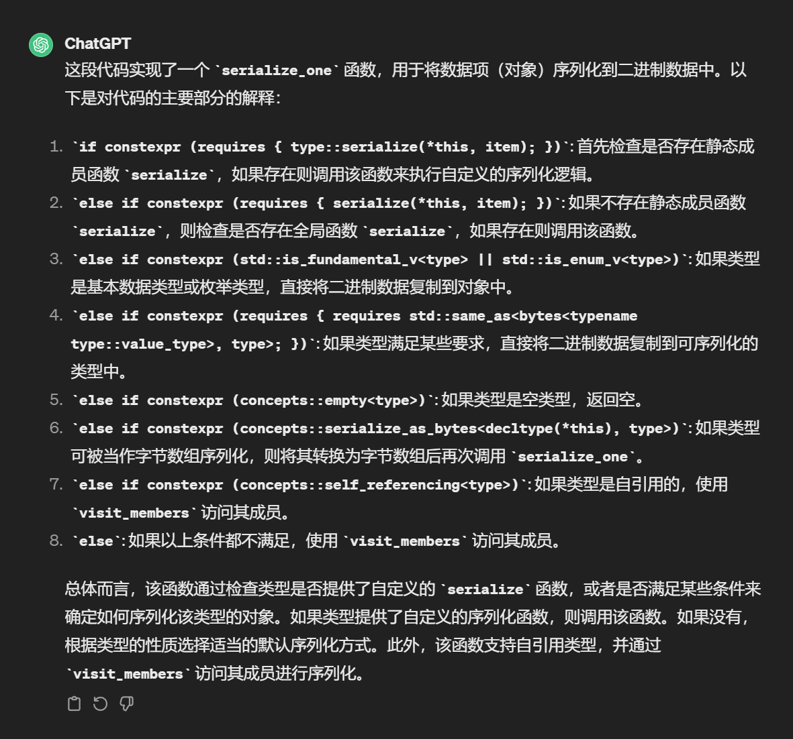
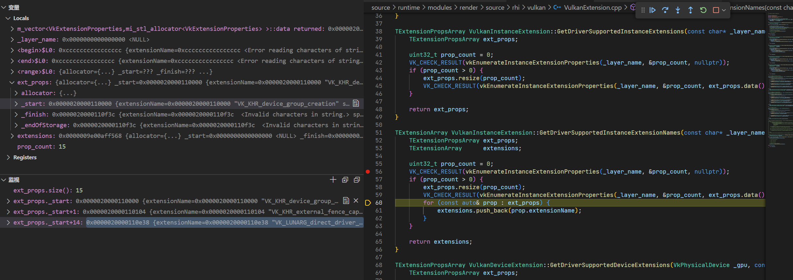
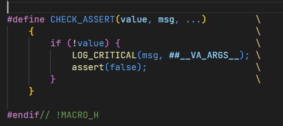

1. camera.cpp中setWorldTransform的问题

1. context 和 impelement 设计模式（实际定义的放在implement中，空壳放在context中）

1. 主程序使用的应该是GLFWWindoImpl，继承自WindowImpl

1. 怎样获取当前的摄像头

1. 回滚函数是否已经设置好了

1. 安装时：设置回滚函数glfwSetxxxCallback，由OnxxxCallback触发，最终调到Onxxx函数，采用handle中对应的函数来实现；返回该回滚函数，如果不为空，则注册该回滚函数（观察者模式还是啥）

1. 单例模式：使用static变量以及getInstance函数，使得每次获取的都是同一个变量（即对应只有一个对象的类）

1. 目前按下对应按键的时候并不会跳到设置的函数进行操作：注册对应的键值和调用对应的键值不同导致的

1. 4元数相机向上旋转180度后左右颠倒问题

1. debug相关技术——不停断点，然后继续运行，重新运行，下条语句，逐过程合并一起用，注意看变量区

1. const表示只读，constexpr表示常量

1. 含有template的函数定义应该直接在.h文件中写

1. const的类对象不能调用非const的成员函数，**只要不改变对象属性的方法都加上const即可**

1. **错误 C2280 “(类名)::operator =(const (类名) &)”: 尝试引用已删除的函数：**

     https://www.cnblogs.com/2018shawn/p/11819164.html       就是加上移动赋值函数

1. unique_ptr  引用已删除的函数的原因：找到emplace_back那里出的问题，但是问题在下面的reserve函数中，construct时没有使用std::move，从而导致这里进行了拷贝构造，出错

1. buffer overflow in heap block 问题:  定位到zpp_bits.h中，在序列化时出了问题（result_out_of_range）

     

ss<<file_buff这里，第一次执行时，ss的size还是0（导致后面报错），debug时continue执行完后面的程序（后面都正常）之后，关闭，再次执行程序时，这里ss的size就不为0了；会不会是第一次执行程序的时候shadercache还没缓存，所以一开始为0？

在m_vector的情况下continue，出现没有vk_khr_surface错误提示，调试过程——学会了监视的用法：

继续debug，发现vector<T>(x)初始化时，size是会变成x的，并且使用push_back之后，会变成x+1个元素

***

这里的##保证了当__ VA_ARGS __ 为空时，不会变成: LOG_CRITICAL(msg, )，从而造成语法错误

***

定义静态成员的时候要注意类内声明之后，类外还需要定义（最好是在.cpp中定义，防止重复定义的出现）