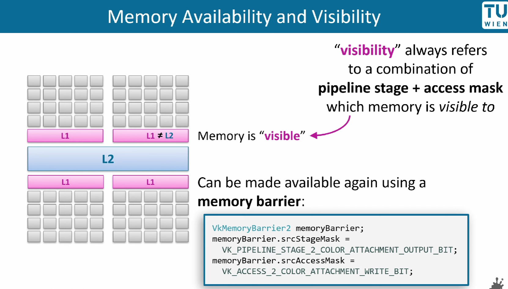
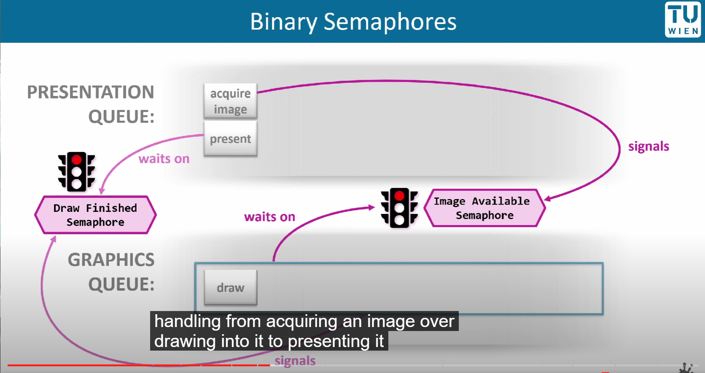

[TOC]

c++ alignas的理解：https://blog.csdn.net/wendyWJGU/article/details/134859784

***

Camera类：lookat类型的cam的view矩阵为什么是先乘rot再乘trans？

***

* glsl中，vec3 * vec3 是将两者对应的分量相乘后作为新的分量，结果仍是vec3；vec3加标量的结果也还是每个分量加上这个标量，仍为vec3

***

commandLineParser.hpp：用于解析输入的命令行语句(Parser)

***

initializers：用于初始化vk结构体（复杂的例如swapchain等就要按正常方法来写）

***

有关系的东西就可以写在一个struct里

***

***

从staging buffer复制到device local buffer的时候：使用vkBufferCopy来传递copy的信息，包括srcOffset，dstOffset，size三个参数（整个拷贝的话直接默认前两者为0即可）

Image则不同，用vkBufferImageCopy，还要考虑transition问题（见后面）

***

descriptor set layout：用于给不同的shader stages 绑定不同的descriptor types，如uniform buffer/image samplers等；**every shader binding should map to one descriptor set layout binding**

***

## stageMask & Access Mask 相关问题

**关于pWaitDstStageMask和srcStageMask等的理解**：**https://zhuanlan.zhihu.com/p/350483554**；pWaitDstStageMask表示cmdbuffer会先执行到当前的步骤，然后阻塞并等待semaphore，而不是一开始就阻塞；srcStageMask/srcAccessMask/dstStageMask/dstAccessMask：

总结：主要问题就是再次从swapchain中拿出一张image的时候其layout是present_KHR，如果使用默认的dependency会出现问题（可能这张图片上次还没被输出完成就开始了layout转换）；使用显式的话写成如上面倒数第二幅图的样子，表示在等待该图片上次output的所有操作结束后（包括semaphore被标记后），再进行layout transition，然后再进行后面的subpass操作，如最后一张图所说

在vkcmddraw和vkcmdendrenderpass之后，framebuffer的color attachment会隐式变成VK_IMAGE_LAYOUT_PRESENT_SRC_KHR格式，以供之后的呈现步骤

***

## descriptorset相关问题

* descriptorsetLayout：将其中的descriptor类型和对应的shader stages绑定，**every shader binding should map to one descriptor set layout binding**，说明一个descriptor的布局是什么样，有几个binding，分别对应什么类型的descriptor**（见descriptorsets.cpp）**

* descriptorPool：声明要使用的descriptor类型以及最大数量（主要就是声明要分配的大小之类的）

* descriptorSets：用于指向uniform buffer或image sampler等，供shaders来获取全局变量，实际的buffer数据存于VkDescriptorBufferInfo结构体中，最后通过VkWriteDescriptorSet结构体（其中制定了要更新的set和对应的VkDescriptorBufferInfo）在vkUpdateDescriptorSets中传递

**2024/4/1总结**：先搞定pool（说明白每种类型的descriptor各要多少个（set个数*每个set中有多少个），以及最多分配的个数）；然后解决layout（可以有多种布局方式）；最后分配真实的set（绑定pool 和 layout 和 要分配的个数，然后绑定writeDescriptorSets（其中包含真正的信息），最后vkUpdateDescriptorSets）

***

vkMapMemory：将最后一个参数指向的地址与device中分配的内存buffer进行映射，从而使得通过最后参数指针可以修改分配的buffer的内容

***

## onenote上整理的记录

***

## FLAG_BITS相关问题

### MemoryPropertyFlagBits：

### BufferUsageFlagBits

### pipelineStageFlagBits：

https://imgtec.eetrend.com/blog/2020/100048837.html

***

## glsl的location/set/binding相关问题

glsl中，layout后面的location，set和binding的含义：

其中，具体在一个frag和vert shader中有几个set是在pipeline layout那里

***

## Vertex Input 的理解

对Vulkan Vertex Input Description的理解：

​		1.	https://zhuanlan.zhihu.com/p/450157594

​		2.	https://blog.csdn.net/Motarookie/article/details/128844604      	没细看，讲的好像更清楚

解释：上图中vertex的数据格式是：position, color, position, color, ..., instancePostion, instancePosition,...，这样的。因此对于同一个顶点来说，要取得的是position + color + instancePosition，就需要分成两个binding来取（两边的步长不同，需要分开取），这里就是binding description要干的；而每个步长中的属性怎么分配，对应shader中的location几，就是attribute description来干的。

***

## 两种constant对比

push_constant和specialization_constant的区别：

还有pc是在pipeline创建时绑定layout信息，但是在draw之前才指定实际数据，作用域是pipeline

而sc是在shader module创建后，pipeline创建前绑定好，作用域是shader域

***

## Texture 相关问题

获取image时，一般还是先用staging buffer来取得数据，然后copy（通过vkBufferImageCopy这个结构体），注意，当图片含有mipmap时，要考虑每一级的mipmap的offset以及长宽对应的大小变化；

* 与buffer不同的是，image需要考虑transition layout的问题，对应到例子中：第一次是从staging buffer拷贝到Image前，变为transfer_dst layout；第二次是拷贝结束后到读取image前，变为shader_read layout

* **重点:**   具体可以见vulkanTool.cpp 中的 **setImageLayout** 函数，如下：

  

  ---- 疑问：newLayout那边dstAccess的含义？是不是指在这个动作前transition必须结束（应该是，看上面stageMask那一部分）

**VkImageMemoryBarrier 用于在合适的阶段更改image layout，其中VkImageSubresourceRange定义了transition时的image对应region，其中参数如下图：**

之后还需要用到sampler和view这两个东西，使用**VkDescriptorImageInfo**来将view，image，sampler三者结合作为**COMBINED_IMAGE_SAMPLER 的 Descripter Info**

* 关于Texture array：见texturearray.cpp，后续看完instancing之后再看一下

***

## cubemap相关问题

别的大体相同，注意cube faces在vulkan中算作传入的image中的layer（因此数量为6）

然后sampler正常写，view需要将viewType声明为cube

shader中的相关问题：一个是坐标系问题，二个是拖拽的相机的实现仍然需要理解（为什么shader里面没有model矩阵，以及为什么光源的位置是相机空间中的0，-5，5）

***

## Vulkan坐标系问题

https://zhuanlan.zhihu.com/p/671588535

***

## Vulkan面向对象设计

### 1. vulkanDevice类

* **总结：管理physicalDevice，logicalDevice，内存分配memTypeIndex查找，buffer创建，queueIndex查找，extension检查，commandPool创建、commandBuffer创建，获取depthformat**

typeBits 和 propertyFlags的区别：

* typeBits可以直接声明为uint，利用的是其二进制的数据，每一位表示一种类型，为1则表示是否有当前类型需要匹配，即比较时是一位位比较，然后右移，改变最低位
* propertyFlags也是每一位表示一个信息，但是是整体与对应的flag进行相与，然后判断结果是否还是flag，是的话表明符合要求
* 在getMemoryType中，先判断typeBits是否为高，为高的话接着判断是否满足该类型所有flag，看下面

* 分开找queueFamily的目的：**尽可能地将不同类型的任务分配到不同的队列族，以实现任务的并行执行，从而提高整体性能**（见VulkanDevice.cpp）—— **理解位与&**：只有设备支持的flag**包含**要求的flag才行，因此只有&后得到的是要求的flag时，才表明能支持要求的操作

***queue**是通过创建logical device时指定需要的queue的type，进而和Logical device一起创建出来的*

***queueFamilyIndex**是在创建device的时候顺便获取的*

### 2. vulkanBuffer类

* **总结：包含buffer，memory，device，descriptorInfo（真正的descriptorSet只在程序中唯一出现，所有ubo的descriptorInfo都会绑定在上面），内存绑定，类型flags等**

### 3. vulkanTexture类

* 总结：包含device，image，imageLayout，view，sampler，memory以及descriptorInfo等，功能函数包括swapchain创建（包含recreate），呈现图片，获取下一张图片等

  

### 4. vulkanSwapchain类

surface这个东西只跟swapchain有关，因此放在里面，然后包括instance，swapchain images以及对应的view，还有format，以及swapchain用来present的queue（这里要求支持graphics和present操作）

* **对指针操作的思考：当对指针指向的值进行覆盖写入的时候，原来的值就不需要额外的destory操作来删除了，因为数据被直接覆盖了**

* 看这里imageSharingMode对是否要设置queueIndex的影响

* 注意这里swapchain中的image不需要自己销毁，销毁swapchain的时候自动会销毁

### 5. vulkanFrameBuffer类

* 总结：包括attachment类，framebuffer本身，renderPass（**创建framebuffer时要制定render pass，其中render pass 制定了对应的attachments等**），sampler等

### 6. vulkanGLTFModel类

* 为什么下面这个地方还要+vertexStart —— 见图中文字

* **为什么第一个example里面用的是两个descriptorset，一个用于martix(set = 0, binding = 0)，一个用于texture(set = 1, binding = 0)，而不是将两个合到一起**：第一个是大家一起共用的，不需要重复创建（所以pool那边数量为1）；第二个是每个image自己独有的，因此要单独创建(每个不同的面对应的texture的image不同)，所以pool那数量为image的数量。分开创建很清晰（应该也可以合起来创建，但是那样的话matrix会多创建不少）

***

## pNext指针的意义

https://www.youtube.com/watch?v=tLwbj9qys18&list=PLmIqTlJ6KsE1Jx5HV4sd2jOe3V1KMHHgn

***

## Vulkan YouTube视频

### presentation mode

* immediate/ FIFO/ MAILBOX等
* vertical blank period(vb)：屏幕从上到下present完一张图片的时间（一次完整扫描）
* **immediate**：不等vectical blank，直接交换，可能导致tearing 
* **FIFO**：等（且必须等下一个vertical blank发生），但是可能造成lagging（如果画的很慢的话，屏幕会先经过很多个vb，然后image会在to be presented队列里先等待下一个vertical blank，然后渲染）
* **FIFO Relaxed**：解决上面的问题，如果图片画好后检测到屏幕没画面，会不管vb和to be presented队列直接进入，从而减少延迟，但是可能在扫描一半时进入，再次造成tearing
* **mailbox**：将to be presented队列优化为一个只能放一张图片的mailbox（因此图片渲染过快的话会将之前已经画好，但是还没有present的mailbox图片直接挤掉）
  * 

### resource & descriptors

* resource：

  * buffers
  * images
  * samplers
  * Acceleration structures

* descriptors：用于描述上述资源

* buffer：

  * load = read only

* 第3集14:34开始，总结buffer和image

  * https://www.youtube.com/watch?v=5VBVWCg7riQ&list=PLmIqTlJ6KsE1Jx5HV4sd2jOe3V1KMHHgn&index=3
  * 

* descriptor set的绑定，在cmd buffer level（尽可能少的更改绑定），即能多复用就多复用，少更改idx，如下：

  

  然后的过程：将这个cmd1-4打包给到queue，gpu编译后自动将上图中已经分配好的资源分别给到对应的cmd，最后submit

* bind_point：对应不同管线下的不同binding，互不干扰，如下图：

  

* 关于descriptors的具体下图，见外面的pdf文件

  

### Commands & command buffers

* command buffer usage mode:
  * reuse(submit multiple times)
  * single-use(submit once)
  * reset & rerecord

* primary vs secondary cmd buffers

  

  * 注意 secondary cmd buffers 并不从primary cmd buffers上继承states

* data -> cmd的方式

  * descriptors

    * 传入上面所说的资源之类的（注意与第4点区分）

  * push constants

    * 直接在cmd buffer中保存，注意大小的限制是对于每一个cmd而言的，并不是对于整个cmd buffer而言

  * parameters

    * 例如一些不支持descriptor的操作，如vkcmdcopybuffer

  * attributes

    * 即例如顶点数据这种，shader中使用layout(location = 0)来获取的

    * 下图中，binding表示的是整体数据，attribute表示的是对整体中某一部分数据的描述（两者的.binding要对应，且都对应内存中的某一个buffer）

      

### pipelines & stages

* graphics pipeline：

  

  * 对应的stages，例如VERTEX_INPUT_STAGE这种，见pdf ep5，如下图：

    

    * 其中，color_attachment_output_stage表示渲染好的图片放回了内存中

* compute pipeline：
  * 可以用来实现一些后处理（用各种核之类的）
  * 只有两个stage

* ray tracing pipeline：
  * 只有两个stage，见pdf文件

* 
* top 和 bottom 可以改成all 和 none
* 这一节后面可以重新看看

### real-time ray-tracing（后续用到的时候再看）

* acceleration structure(AS)

  * instance的概念（如下图中的绿球，是同一个模型，但是经过不同的变换得到的），因此对应相同的bottom-level AS

    

https://www.youtube.com/watch?v=GiKbGWI4M-Y&list=PLmIqTlJ6KsE1Jx5HV4sd2jOe3V1KMHHgn&index=7

### synchronizations

* 例子：对于下图中的descriptor A（假设对应的是某一个vkimage），那么对于cmd 1 2 3，就需要对image A的访问进行一个顺序的限制

  

  

* **barrier**：直接写到cmd buffer中，因此在cmd buffer提交后， buffer这层边界变得不重要（**inside queues**）

  * 分为：execution barrier（不关注memory）& memory barrier（关注memory）

  * execution barrier（不考虑access mask）

    * 

    **这里就是对应的那个stage mask和access mask的区别，stage mask指的是execution sync，但是access mask指的是memory sync**

  * 补充：**Memory Availability & Visibility**

    * **available**：当数据从内存加载到gpu的L2 cache中之后（且更新为最新阶段），则称memory available，**与之相对应的一定是特定的pipeline stage + access mask**
    * visible：数据进一步进入L1 cache后，称为visible，**与之相对应的一定是特定的pipeline stage + access mask**
    * 例如：当前L1中的数据处在Output stage中的write阶段，则此时L1的数据就与L2中原先的数据有区别。如果这个时候别的L1要用这个数据，就会出现问题，**因此这个时候L2又变成unavailable了**。因此使用**memory barrier**来解决这个问题

    

  * memory barrier

  * 所以下图的含义：

    第一部分stage中access产生的结果，一定要“available + visible”，to 第二部分stage的access阶段

    

    例如这里：available指的是1和2的结果从上面两个L1写入到L2，visible指的是L2中更新的结果再给到左下角L1（对应cmd 3）

* **semaphore & fences**：则需要cmd buffer这层边界（更准确来说是一堆cmd buffers组成的batches）

  

  * **semaphore**：**queue sync**

    以present queue和graphics queue为例(swap chain)：

    

  * 分为binary semaphore 以及 timeline semaphore

    * **binary semaphore**：等到之后会自动对对应的events进行unsignal操作

      * queue -> queue, device only

    * **timeline semaphore**：如下图（**注意draw 5中的waits on 是5，而physics中还没有到5的位置，这种对未来的提前透支是只有timeline semaphore才有的**）：

      

      

      * queue->queue，host<->device 都可以

  * **fence**：**device -> host sync**, host side（等待batch的所有操作结束后signal，不管queue中是否仍然有别的**后续的**cmd没结束），即下图中fence并不会signal——只有A也结束了fence才会signal

    

    

* **subpass dependencies**
  * 其实就是image memory barriers
  * 

* event
  * 就是一个split的barrier，即setevent和waitevent中间的事件不受sync影响，setevent前和waitevent后受影响
  * 也可以对host进行sync

整体的描述

waitIdle就是vkwaitQueue，vkwaitDevice这种

***

## imgui阅读

***

## 重构renderer

1. device和instance所对应的extension不同，device对应swapchain等，instance对应glfw/validation layer等

***

## 同步问题

http://forenose.com/column/content/427077449.html

https://blog.csdn.net/Navigated/article/details/131553609

https://zhuanlan.zhihu.com/p/632800454?utm_id=0      （这个介绍了srcStageMask之类的问题）

https://gpuopen.com/learn/vulkan-barriers-explained/   （介绍了vulkanBarrier）

