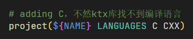

1. 关于重复定义问题：.h只包含需要的头文件，剩下的全部写到.cpp中；同时.h只写常量/变量声明/类，具体定义放在.cpp中写，可以避免该问题（产生的主要原因是在多个.cpp文件中同时包含了该.h文件，导致多次定义，这不是pragma once解决的问题），见 https://blog.csdn.net/wanzew/article/details/81638128

2. 编译ktx库时，一直报错说没有编译成功或者是找不到编译语言：问题在于最外层的PROJECT那边没有指定c语言

   

3. 目前很多地方都是single time cmdbuffer提交，后续可以合到一起一次性提交

4. commandbuffer / framebuffer是按照swapchainImageCount创建，剩下的都是按照MAX_FRAMES_IN_FLIGHT来创建，区分方法：使用current_frame的就是后者，使用imageIndex的就是前者

5. vulkanDevice设置为指针的另一好处：可以自己控制什么时候销毁它，从而触发析构函数

6. 注意VK_SUCCESS的值是0！不能直接用返回值的真假来判断，会反过来！

7. 修改完后记得先生成新的exe，不然debug的时候一直是之前错的！

8. 所有VK成员记得要初始化！

9. 对于使用const **&**作为函数参数的，不能传入一个别的函数返回的**临时值**作为参数——临时值不能被引用

10. 现在的device在选取时，physical card那里检查了一次suitable，vulkanDevice内部也进行了检查

11. 现在暂时还没加入stencil，后面再加（在findDepthFormat那里）

12. 最后出来的图的颜色与原来不同是因为swapchain中设置的format不同——具体可去vulkanswapchain里面看（是否还与image创建时的format有关？）

13. 相互包含的头文件中，使用对方的类之前需要先声明，不然会递归下去，一直找不到对方的声明

14. 目前问题：第一次执行newFrame时并不会有有效的cmdLists，第二次再执行到这个的时候才会出现有效的cmdLists，应该是中间有哪个步骤影响了——问题所在：**commandList在record的时候只会记录当时的状态**

    ***

15. **主程序中vertexBuffer和indexBuffer只需要一个应该是因为是固定的，所以可以被in_flight_frames共享，但是imgui中需要定时重建，重建时如果另一个frame在用的话就会触发validation layer错误，因此可能需要建立多个（目前暂时使用vkDeviceWaitIdle来保证问题不发生，后续改了试试）**

    * 看看有没有办法直接等待一个buffer使用完毕
    * 目前两个问题：1. ~~拖动时出现类似视口不对应问题~~（因为拖动的时候没有及时更新cmdbuffer，即拖动的时候vertexbuffer或者indexbuffer是不会改变的，只有在窗口状态发生变化，例如点击了某个collapsingWindow才会改变，从而recordBuffer）；2. ~~鼠标隐藏时仍然会被捕获~~
* 看看是不是要改回每一帧重录一遍cmdBuffer，或者有没有获取window在被resize的标志位

16. 换成per frame record一次之后，改变了setupImgui的位置，发现出现死循环——fence一开始就是true，不会经历从false变为true的过程，导致一直等待
16. 见vulkan阅读的gltfModel