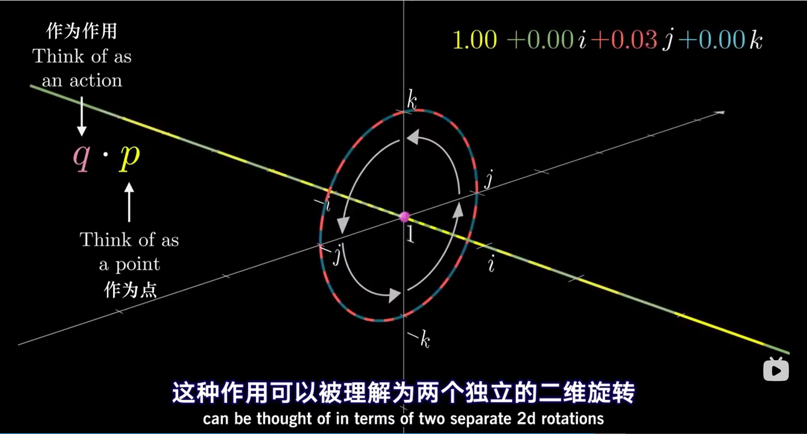

1. 对于三维单位球（1，i，j）投影到二维平面：

   * 单位球被ij平面切下的单位圆在二维平面上是真实的部分，内部对应球上半部分（实部>0），外部对应球下半部分（实部<0）
   * 当球绕着1这个轴旋转时，平面上反映的就是整个平面的旋转，且ij圆自身旋转，形状不变
   * 当球绕着i或者j旋转时，投影平面上的ij圆就会逐渐变成直线（坐标轴），再变回圆

2. 对应四维单位超球（1，i，j，k）投影到三维空间：

   * 单位超球被ijk空间切下的单位球在三维空间中是真实的部分(在初始投影前后保持不变)，内部对应实部>0，外部对应实部<0，该单位球就是单位向量
   * 当超球旋转时，空间中反映的就是整个球体的旋转，可以拆分为两个相互垂直且同时发生的旋转，见3b1b视频    https://www.bilibili.com/video/BV1SW411y7W1

   

   对两个四元数相乘的理解：如上图所说

3. 旋转：p * v * p-1，p形式为：cosx + sinx*(ai+bj+ck)，其中（a,b,c）对应的是旋转的轴，x对应的是逆时针旋转的角度