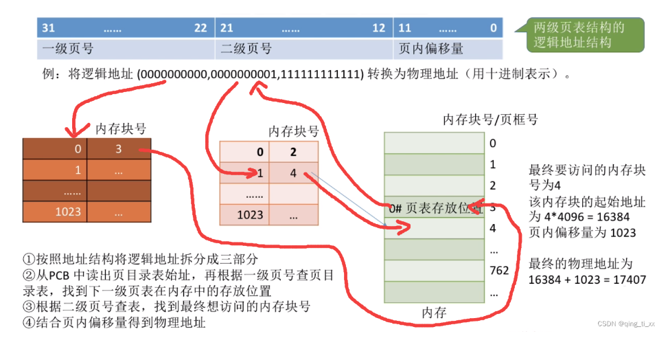
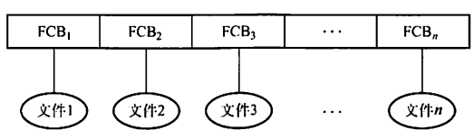
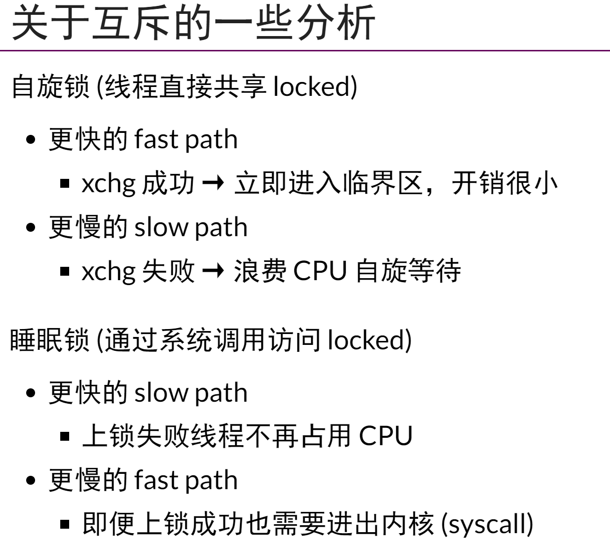
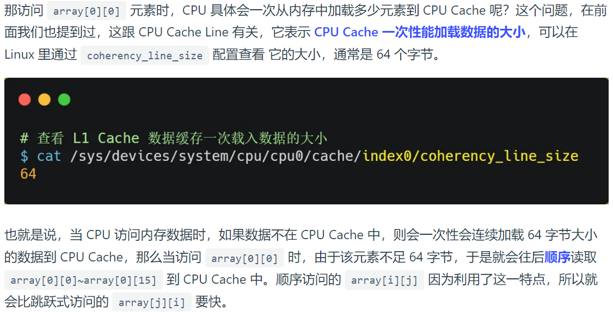

[TOC]

***

## 操作系统概述

* 并发：宏观同时，微观分时（以**线程**为基本单位）

  并行：微观同时

* 异步：执行顺序不可预知

* os作为用户与计算机硬件间的接口：命令接口 & 程序接口（系统调用）

* 操作系统分类：批处理（单/多）、分时、实时

* 特权指令：不允许用户直接使用的指令，如IO、中断等

  非特权指令：允许...，不能直接访问系统的软硬件资源，只能访问用户的地址空间

* CPU运行模式：用户态 / 目态 & 核心态 / 管态（通过**硬件中断机制**实现 前者 变为 后者）

  

* 内核：计算机配置的底层软件，管理系统的各种资源，工作在**核心态**，一般包括：
  * 时钟管理
  * 中断机制
  * 原语（不可被中断）
  * # 系统调用类指令

* 中断：外中断（执行cpu指令外的事件，如IO中断，时钟中断等）

  异常：内中断（cpu指令内部出现的事件，如非法操作码，地址越界，算数溢出，缺页等）

* **系统调用**（运行在核心态）：os中特殊的公共子程序，凡是与资源相关的操作都要通过系统调用，如下（**重要！！！！**）：

  

  可以通过trap来调用系统调用（变核心 -> 执行系统调用 -> 回用户）

  

  过程：

  

  

  中断要保留的（注意：保存断点是硬件执行的）：


***

## 进程与线程

* **进程**的目的：更好地让多个程序并发执行，提高吞吐量

* **进程**是一段程序的一次执行（**下图中，注意区分阻塞和就绪：就绪态只等待cpu，阻塞态等待其他资源**），**注意：进程结束会直接撤销进程，能回到阻塞态说明还没有运行结束**

  

  * 上图中，从 阻塞 -> 就绪 称为**进程的唤醒** 

* 进程的组成：PCB（是进程存在的唯一标志）、程序段、数据段

* **进程间通信**：
  
  * **管道通信**：
    * 有输入端fd和输出端fd，使用简单
    * 不适合进程间频繁通信，效率低
    * 可以通过fork来创建子进程（从而复制fd）来使用管道

  * **消息传递**：
    * 像寄邮件一样，一方寄完后可以干别的事，接收同理
    * 消息队列存储在内核中，因此发送消息和接收消息都要从用户态切换到内核态
    * 可以频繁沟通
    * 但是：通信不及时、附件有大小限制、存在用户内核态转换开销
  
  * **共享内存**：
    * 将不同虚拟地址映射到同一物理地址上，使用一块额外的共享空间，用PV操作来实现同步互斥读写
    * 没有从用户态到内核态的转换过程
  
  * 异常情况下的进程通信：
    * 信号：例如SIGINT，SIGSEGV，那些
  
  * **socket通信**
    * 适用于不同主机间的进程通信
    * 也适用于同一主机间进程通信
  
  * **共享文件**
  * **<注意>**：全局变量是针对同一进程而言的，不能促使进程间通信
  
* **线程**：轻量级进程，用于减少并发时的时空开销，提高并发性能，调度的开销比进程小很多
  * 线程是处理机cpu调度的基本单位，可以独立执行程序
* 同一进程的线程间共享进程的地址空间和资源，不同进程间的线程不共享

* 线程的实现方式：用户级ULT和内核级KLT，如下：

  

* 多线程模型：

  


* **处理机调度**
  * 调度：按照一定算法，选择一个进程，并将处理机分配给它运行，来实现并发执行
  * **三层调度**：
    * 高级调度（作业调度）：从外存中选择作业进入内存，建立对应的进程
    * 中级@（内存调度）：将暂时不运行的进程调度到外存中等待，提高内存利用率
    * 低级调度（进程调度）：从就绪队列中选取一个进程，将cpu分配给他
  * 调度算法：
    * FCFS：先来先服务
    * SJF：短作业优先
    * 优先级调度
    * 时间片轮转
  * 进程切换：上下文切换（要保存旧进程的状态到pcb中）
  * 周转时间：从开始到运行结束的时间  ——  平均周转时间：几个进程周转时间的平均值


* **同步与互斥**

  * 临界资源：一次仅允许一个进程使用的资源，对临界资源的访问必须互斥地进行

    * 访问临界资源的代码称为临界区

  * 同步：多个进程之间有顺序上的约束关系

    互斥：访问同一个临界资源时，需要等待别人访问完成

  * 同步遵循的准则（第四点非必须）：

    

  * **实现互斥的方法（软件方面）**

    * 单标志法：使用同一个变量来约束 —— 不能不交替进行（自己完成后必须等对方完成才能再做）

    * 双标志法先检查：使用flag[i]来约束 —— 未用原语，可能导致同时进入临界区

    * 双标志法后检查：可能导致饥饿

    * **peterson算法**：结合一和三（turn保证一定有一个可以进去）

      
      
    * 

    * 最终谁手上有旗子并且厕所上是他的名字，就先进厕所

    * 精髓在于往门上贴（相当于谦让对方）：最终造成的结果是谁手快谁进

  * **实现互斥的方法（硬件）**

    * TSL（test and set）：读出指定的lock的旧状态，并将其设置为真

    

    * swap指令
  
  * 互斥锁（常使用硬件机制实现），缺点：可能导致忙等待，初值为1
  
    * 即：同一时间只能有一个进入临界区，而semaphore是可以多个
  
  * **semaphore**，初值由用户决定（**带计数器的锁**）
  
    * P操作：wait
    * V操作：signal

  * 分为：整型信号量（仍可能导致busy waiting） & 记录型信号量（使用一个等待的进程链表）
  
    
  
    上图中，只要s.value < 0，就说明仍有进程想要获取该资源但是正处于等待状态
  
  * 信号量可以实现同步与互斥
  
    * 同步：在前者的行为后面执行V操作，在后者的行为前面执行P操作
    * 互斥：在临界区的前后分别使用P和V
  
  * 管程：Monitor
  
    * 将对共享资源的操作封装起来，只能通过接口来实现
    * 每次仅允许一个进程进入管程，从而保证互斥访问（多个进入时会在其等待队列中等待执行）
    * **管程的wait和signal操作与PV不同**，只判断条件变量（**没有值**），不会对什么资源进行+1-1操作
      * 判断是take_away和give_back这类的进行的操作

  * 经典问题

    * 生产者消费者：mutex（futex其实更好）, full(生产好的数量), empty(待生产的数量)
  
      * 生产者：先mutex获取lock，若cnt == n（注意一定要是while而不是if），则unlock并循环，否则生产后unlock
  
      * 消费者：先mutex获取lock，若cnt == 0，则unlock并循环，否则消费后unlock
  
    * 读者写者
  
      
  
    * 哲学家进餐：多加一个互斥量，即先判断是否有两个筷子可以拿
  
  * 让权等待：在不能进行的时候回到就绪态，放弃对cpu的争抢权


* 死锁

  

  * 死锁避免算法：银行家算法：

    

  * 死锁的必要条件：

    * 互斥（对临时资源进行排他性使用）
    * 不剥夺（只能主动释放，不能被剥夺）
    * 请求保持（对自己已获得的资源保持不放，又提出新的资源请求）
    * 循环等待（存在一种等待链）

  * 死锁问题求最小的可能发生死锁等之类的问题：使用鸽巢原理，极端情况每个少一个，然后再加一个即可

***

## 内存管理

* **程序的链接与装入**

  * **链接**的三种方式

    * 静态链接：一开始连接好
    * 装入时动态链接：装入内存时边装入边链接
    * 运行时动态链接：执行时才装入内存和链接

  * **装入**内存的三种方式

    * 绝对装入：适用于单道程序环境，直接用绝对地址

    * 可重定位装入/静态重定位：地址变换在装入时一次性完成

    * 动态运行时装入/动态重定位：装入时不改地址，在运行时通过重定位寄存器转换地址

      

* **逻辑地址 & 物理地址**

  * 相对地址（逻辑地址）是程序中的地址
  * 物理地址是内存中物理单元的集合，是地址转换的最终地址
  * 当装入程序将可执行代码装入内存时，逻辑地址要被转换为物理地址，即**地址重定位**
  * os通过 MMU 来进行这个转换

* **内存保护（防止越界）**

  

  * 其中，重定位寄存器用来 +， 而界地址寄存器用来 比

* **连续分配管理方式**

  * 单一连续分配：利用率极低

  * 固定分区分配：每个分区只装入一道作业，可能会出现装不下或**内部碎片**的问题

  * 动态分区分配：如下，会出现**外部碎片**的问题

    

    

* **非连续分配管理方式**

  * 分为：分页存储 & 分段存储

    * 分页：通过硬件机制实现，对用户完全透明 —— 有内部碎片，无外部
    * 分段：考虑用户和程序员，以满足多方面需要 —— 有外部碎片，无内部

  * **分页存储**

    * 主存分块，进程也分块，进程在执行时以块为单位逐个申请主存中的块空间，以减小碎片

    * **页 / 页面：进程中的块**

    * **页框 / 页帧：内存中的块**

    * **逻辑地址结构**（即逻辑地址怎么看，怎么从逻辑地址获取页号与偏移量，注意是**地址**不是内容！）：

      

    * 页表：实现从页号到物理块号的地址映射（**页表也在物理内存中**）

    * 页表项：每一行

    

    * 如何执行：

      

    * 优化：快表/相连存储器TLB

    

    * **两级页表**

      * **重点：每个页表大小不能超出一个页面**

      * 目的：建立索引，减少空间浪费以及盲目的顺序式查找页表项

        * **即进程在执行时不需要像上面那样把整个页表调入内存，而是调用一级页表，然后按需要调用后面的页表**

      * 其中，顶级页表只能有一个页面，因此顶级页表的页表项个数：页面大小÷页表项大小，算出所占的位数，然后算出偏移量的位数，剩下的就是二级页表的位数

        

      * 查询过程：

        

      * **例题**

        

  * **分段存储**

    * 按照用户进程中自然段来划分逻辑空间（段内连续，段间不连续）

      * 特点：每段的长度不固定，因此需要提供段长信息

    * **逻辑地址结构**：

      

    * 段表（**注意判断是否越界**）

      

      

  * 段页式

    * 两者综合
    * 先分段表，再分页表

  * 碎片问题

  

  * 访存次数

  

  

  * 其他

  

  * 页面例题


* **虚拟内存**

  * 局部性原理：时间 & 空间

  * **虚拟存储器**：

    * 核心：利用外存+内存，给用户一种内存很大的错觉

    * 基于局部性原理，在程序装入时进装入当前要运行的少数页面，剩下的要用的时候调入，不用的调出，提供一个比实际容量大的假想的存储器

    * 建立在离散分配的内存管理方式上（分页 & 分段）

    * 分配页面内存的方式：

      * 内存仍有空余页面：请求分页管理方式（不必将分页一次性全部装入内存）
      * 内存没有多余页面：页面置换

    * **常见置换算法**：

      * OPT
      * FIFO：存在Belady异常现象
      * LRU：最近最久未使用
      * CLOCK：每位设置访问位，首次装入或被访问时置1，要替换时，循环遍历访问位，0则替换，1则变0（也即将最近未使用的页面调出，也称为NRU）

    * 抖动：刚换入的页面立刻就要被调出主存，刚换出的立刻调入主存

    * 内存映射文件 memory-mapped files：

      * 将磁盘中的内容与进程的虚拟空间中某个区域建立映射关系，使得该进程不用进行文件的IO操作就可以对文件内容进行读写

    * 虚存的**实际**容量 <= 内外存容量之和

      虚存的**最大**容量 <= 计算机地址位数能容纳的最大容量

  * 例题

    

    

    注意点：页面与进程空间相关（具体看上面的定义）

***

## 文件管理

* **文件控制块FCB**：在创建文件时创建，也即一个**文件目录项**，记录了文件的各种信息

  FCB的有序集合称为**文件目录**

  打开文件：将对应文件的FCB放入内存的活跃文件目录表

* **索引结点 inode**：查找目录的过程一般只需要用到文件名，因此将其他的文件描述信息单独形成一个索引节点的数据结构，则每个文件目录项就仅由文件名和指向inode的指针构成

  * 磁盘索引结点
  * 内存索引结点

* **文件的逻辑结构**：用户观点出发看到的文件组织形式

  * 无结构文件
  * 有结构文件
    * 顺序文件：按存入时间先后排列 或 按关键字先后排列
    * 索引文件：建立索引表（记录文件长度和在**逻辑空间中的起始位置**），把对文件的检索转变为对索引表的检索
    * 索引顺序文件

* **文件的物理结构**：文件的具体实现，在物理存储设备上如何分布和组织

  * 连续分配：每个文件在磁盘上占有一组连续的块

    * 优点：简单、存取速度快
    * 缺点：文件长度需要固定，且插入时需要对后面文件做移动，易导致碎片

    

  * 链接分配

    * 隐式链接（对用户不可见）
      * 目录项中含有文件第一块和最后一块的指针，每个盘快都含有指向文件下一个盘快的指针
        * 缺点：只能顺序访问，不能直接访问

    

    * 显式链接

      * 将每个物理块末尾指向下一个盘快的指针拿出来，单独形成一个表，即**文件分配表FAT**
      * -1表示到了末尾，-2表示盘快空闲

      

    * 索引分配

      * 链式的问题：不支持直接访问、FAT较大
      * 解决：将每个文件的所有盘块号集中放在一起构成索引块（也即该文件的索引表）

      

  * 例题

    

    

  * Open系统调用和Read系统调用：

    


* 目录

  * FCB的有序集合，称为文件目录；一个FCB就是一个文件目录项

  * 目录的核心：按名存取

  * 目录结构

    * 单级目录结构：按名存取，速度慢，不适用于多用户os

      

    * 两级目录结构：多了用户目录，然后下来就是上面的目录一样的

      

    * 树形目录结构：有绝对路径和相对路径

      

    * 无环图目录结构：方便的实现了文件共享，但管理困难

      

  * 文件共享

    * 基于索引节点（硬链接） &    基于符号链（软链接）

    * **硬链接**：

      

      基于索引节点 —— 上面进行计数，只有清0时才真正删除文件

    * **软链接**：在别的用户上创建一个LINK类型的新文件，与原文件同名，但是只包含该文件的路径名，执行时由os根据路径名来找到该文件，然后读取（只有文件主才拥有指向文件索引结点的指针），类似于**快捷方式**

  * 查找方式

    * 线性表：对应顺序查找
    * 哈希表：对应散列查找


* **文件系统**

  * 外存空闲空间管理

    * 空闲表法
    * 空闲链表法
    * 位示图法
    * 成组链接发

  * 虚拟文件系统：为用户程序提供了文件系统操作的统一接口

  * 文件打开过程描述

    

***

## IO管理

* 概述

  * IO端口：独立编址 & 统一编址（内存映射IO）

  * IO控制方式：

    * 程序直接控制：cpu直接对外设状态进行循环检查，导致利用率极低
    * 中断驱动：允许IO设备在读完后向CPU发送中断请求，即CPU向IO控制器发送命令后可以接着做别的事，直到收到中断请求后再接着处理IO设备
    * DMA：CPU收到IO的DMA请求后，给DMA发出控制命令，后续都由DMA管理，CPU去干别的事

    

* 高速缓存与缓冲区

  

* Spooling技术（假脱机技术）

  * 可以将独占设备改造为共享设备
  * 通过这样处理的设备称为虚拟设备
  * 注意下面：输入井是在磁盘上，缓冲区是在内存上，都是先经过缓冲区后到井
  * 
  * 
  * 

* 设备的独立性：

  


* **磁盘**
  * 读写操作时间由：
    * 寻道时间：磁头移动到指定磁道的时间（一般时间最长）
    * 旋转延迟时间：转到对应的扇区的时间
    * 传输时间：读数据/写数据的时间
  * **磁盘调度算法**
    * FCFS：先来先服务
    * SSTF：最短寻找时间优先（先找最近的）
    * SCAN：电梯调度，要知道初始位置和磁头的移动方向，到头后掉头


***

## 南大jyy课

## 指令部分

### Linux基础

* gcc：用于编译c代码的工具
  * gcc main.c && ./a.out：可以同时进行编译和运行
    * gcc -E name.c -o name.i：将name.c里面的宏全部展开生成name.i，即预处理
    * gcc -s name.i -o name.s：将name.i编译成为name.s，即编译，生成汇编
    * gcc -c name.s -o name.o：汇编，翻译成机器码
    * gcc name.o -o name：链接
    * -O1和-O2：对应编译器在编译时的优化力度
* g++：同上，只不过用于c++
* gdb：调试工具
  * 首先需要生成debug的版本：gdb **-g** test.c -o test 
  * 然后用 gdb filename  来开始调试
  * 结束命令：quit
    * l：查看代码内容（默认生成开始的10行）
      * l 行号：以行号为中心
      * l 函数名：列出某个函数的源代码
    * r：从开始执行程序，即开始调试，直到代码结束或者遇到断点。每次r会从头开始
      * n或者next：逐过程，即f10
      * s或者step：逐语句，即f11
      * c：从当前位置开始执行直到运行到下个断点
      * finish：执行到当前函数返回，并等待命令
    * b 行号：在某行设置断点
      * b 函数名：在函数开头设置断点
      * d：删除所有断点
      * d n：删除序号为n的断点
      * disable 编号：关闭断点
      * enable 编号：打开断点
    * display 变量名：对变量进行监视
      * watch point：监视变量状态，发生改变立即停止调试，并显示更改前后的值
    * backtrace或者bt：查看当前堆栈调用（**用于看执行过程**）
      * info frame：查看当前函数的堆栈帧信息（当前函数栈的各种信息）
      * info locals：查看当前帧栈局部变量的值
      * info registers：看到寄存器的信息
* 基础指令

  * ps：processStatus，用于列出系统中当前运行的进程的快照
  * echo：用于将一段文本输出到终端或者重定向到文件中
  * **dup**：创建一个现有文件描述符的副本(一定是当前可用的最小值)，注意也**共享偏移量**
    * fcntl：也是创建一个fd的副本
  * getpid：获取进程号
  * getppid：获取父进程号(process parent)
  * getpgid：获取进程组号(process group)
    * pgid：所有fork出的进程默认使用同一个pgid
  * &：后台运行符
  * 硬链接：ln，软链接：ln -s（symlink）
* 管道符 | ：

  * 将左边的输出作为参数传递给右边的输入
  * 应用：ls ./a.out | less，将a的输出管道给less程序，从而可以分页显示输出（less是个阅读的指令，每次输出部分内容）
  * ls | wc：统计ls输出的数目（**wc是内容统计的命令，word count**）
  * ls | wc -l：统计数目并打印第一个
* IO：
  * read
  * write
  * ioctl：配置、查询状态、控制设备

### 课程里用到的

* **gdb调试**
  * gdb a.out
  * layout src：切换到源代码视角
  * layout asm：切换到汇编代码的视角
  * start：开始调试，在main函数的地方会停下来
    * starti：从第一个机器指令开始暂停（asm状态下）
  * snapshot（虚拟机里面那个快照）：获取过程中某个状态，在该状态后继续调试
  * **逆向调试：**
    * record full：开始记录
    * record stop：结束记录
    * reverse-step(rs)或者reverse-stepi(rsi)：逆向调试
* **volatile**：表示与该变量相关的部分不可被编译器优化（**每次都从主存中（而不是寄存器中）读取该变量的值**）
  
  * 作用：确保多线程下共享变量的可见性
  * 防止编译器将变量从内存中装入cpu寄存器中
  * 效果等同于**添加：asm volatile("" ::: "memory")，即添加优化不能穿越的barrier**，语句的作用是告诉编译器这里对内存进行了改动，不是你直接看到的那样可以直接优化的
* **trace：**
  
  * strace：可以真正看到一个程序执行的所有系统调用(syscall trace)，每个系统调用就对应一个syscall指令
    * **第一步永远是被操作系统加载：execve（重置fork出来的，然后变成当前程序）**
    * [strace -f ./a.out a.out对应参数]：-f表示除当前进程外，还追踪子进程
    * [strace -p pid ./a.out]：-p表示制定要跟踪的进程pid
    * [strace -T ./a.out]：-T表示可以获得每个syscall所花费的时间
    * [strace -o ./name ./a.out]：-O表示将结果输出到某个文件中
  * ptrace：process trace
  
    * 为一个进程提供了**观察**和**控制**另一个进程的执行过程的能力，同时也提供**检查**和**改变**另一个进程的内存值以及相关注册信息
  
    * 允许一个进程（称为跟踪器）附加到另一个进程（称为被跟踪进程）上，然后监视和控制被跟踪进程的行为。`ptrace` 主要用于调试器、进程监视器和系统工具等应用中。
    
    * 使用 `ptrace` 通常需要一些特权，比如需要以 root 权限运行或者具有适当的权限。
    
    * ```c++
      #include <sys/ptrace.h>       
      long ptrace(enum __ptrace_request request, pid_t pid, void *addr, void *data);
      ```
    
    * https://blog.csdn.net/qiqi_6666/article/details/132591770
* **thread**中
  
  * **join**：阻塞当前thread直到调用该join的线程已经结束
  * **detach**：将线程分离出去，相当于放到后台
* **SIGSEGV**：signal segmentation violation
  * 见**复习要点**那里

* ./a.out | head -n 100 | sort | uniq -c
  * 表示的含义：运行a.out，并取前100行，排序之后，去重并统计向同行的个数
* Profiler和性能摘要：
  * 告诉你程序里哪些地方值得性能优化
  * 隔一段时间暂停程序，观察状态机执行
  * perf stat ./a.out：获取a.out的状态性能指标（perf：performance）
  * perf list：查看各种信息
  * perf record
  * perf report

* switch_root：调用pivot_root，用来销毁初始的文件系统，然后创建一个新的根文件系统
  * pivot_root可以将根目录替换为指定目录
  * 参数：new_root，old_root

* **fork()系统调用**
  
  * 复制一份状态机（只有pid不同），返回pid
    * 因此pc会相同，所以复制的两个进程会在同一位置开始继续执行
    * 因此fd和offset共享，父进程对offset的变化会同步到子进程，反之同理
    * 是完全复制，因此包含缓冲区的数据（不加\n导致多输出的原因）
    * 对于父进程：返回子进程的pid
    * 对于子进程：返回0
  
* **execve()系统调用**
  * 重置状态机成为另一个程序的初始状态，但是**不重置操作系统对象**
  * 即当前进程运行到某一行后调用execve，下一行就会变成另一个程序的第一行接着运行
  * 所以一般都是先fork出一个新的状态机，然后判断如果**返回的pid==0，即为子进程**，则执行execve，变到另一个程序进行执行
  * **参数：filename, argv, envp；后两者为参数和环境变量**
  * **负责决定一个文件是否可执行：**
    * **对于a.c：**
      * **若没有权限：返回EACCESS**
      * **若有权限：返回ENOEXEC**
  
* **exit()系统调用**
  
  * 执行exit调用的进程会从状态机中销毁
  * 有销毁当前一个线程，销毁所有线程等几种方式
  * 注意和_exit(int status)的区别，IO缓冲带来的问题：\n可以解决（不进入缓冲，直接输出）
  
    
  
* 简化进程创建过程：
  
  * posix_spawn：6个参数
  
* **yield系统调用**

  * 让当前线程让出cpu使用权，进入就绪态

  * 但不能保证别的线程能执行，也可能自己立刻继续执行

* **pmap**：查看进程的地址空间，会给出对应的地址空间的可读可写可执行性质等

  * **通过访问procfs来实现**

* **vdso**：不陷入内核态来执行只读的系统调用

  * 例如：time()

* **mmap系统调用**：
  * 在状态机上增加/删除/修改一段可访问的内存（实际上是映射）
  * mmap：在addr上映射一个长度为length的区间，其访问权限为prot，映射方式为flags，fd为文件描述符（对应一个打开的文件），offset为偏移量，后两者用于映射文件的一部分到状态机的内存中去
  * munmap
  * mprotect（修改映射权限）
  * 

* **mount系统调用**：（挂载）

  * 可以将设备的文件系统挂载到任何想要的位置上

* lsblk：查看系统中的block devices

* mkdir：创建目录

  * rmdir：删除一个空目录
    * rm -rf会遍历目录，逐个删除

* **link系统调用**：硬链接

* **symlink系统调用**：

  * 符号链接（软链接）

* pwd：print working directory查看当前系统目录

* lseek：在打开的文件中移动文件指针的位置

  * lseek(fd, offset, whence基准状态)
  * stat或者fstat：获取文件的信息或状态
  * ftruncate：将指定的文件大小改为length指定的大小（truncate：截断）


***

## 内容部分

* C程序就是状态机
  * 每次调用函数都会创建一个新的栈帧，状态就是栈帧的列表+全局变量
* syscall：状态间特别的一类转换，实现了程序与os的交互，将程序的状态完全交给os，然后os进行任意想进行的操作
* 可能的面试：
  * 第一条执行的语句？  starti
  * 执行main函数之前之后发生了哪些系统API调用？用strace来看
* 多处理器：
  * 不原子：一条语句不可以保证原子性（不被打断地执行完）
  * 能乱序：编译器在优化时可以对内存访问乱序
  * 不立即可见：处理器也是编译器，内部还可能会调换顺序 
* peterson算法：见上面
* 互斥要保证的重要性质：**原子性（看和上锁同时进行）**
* **自旋锁**

  * **使用硬件来保证原子**
  * xchg（将自己的值与要用的值进行交换）和lock（添加在内联asm语句中最前面，表示要访问这条语句对应的变量是原子的）：x86自带的原子性读+写操作

* **互斥锁**

  * 利用os，需要**切换到内核态来保证原子**
  * **睡眠锁**：利用系统调用（内部保证原子）来进行锁的分配，抢用资源失败时进入等待队列睡眠
  * 再进一步优化：**futex**：结合自旋锁和睡眠锁的优点
    * 先在用户态自旋，若获得锁，直接进入
    * 若未能获得锁，系统调用后进入等待队列

* 

* 条件变量cv：

  * 条件变量相当于一个包，用于维护一个条件为真（注意不是条件变量为真），**线程可以使用条件变量来等待某个条件为真**，注意理解并不是等待条件变量为真
  * cond_wait（cv, mutex）：释放mutex，进入睡眠状态（注意**下次唤醒时是从当前被阻塞的下一个位置开始执行**）
  * cond_signal(cv)：若有线程在等待cv，唤醒一个线 程（该唤醒的线程会隐式的抢占锁）
  * broadcast(cv)：唤醒所有等待cv的线程
  * **注意同类唤醒导致的问题！**
  * 万能使用方法：

    

  * 使用cv来解决哲学家问题：

    

* 信号量：带有初值的锁

* 使用互斥锁来避免数据竞争：
  * 使用变量前上锁，使用完成后关锁

***

### 操作系统部分

* Firmware：CPU Reset后用于重启os的硬件支持，有BIOS和UEFI两种
* 系统启动的整体流程：
  * os也就是一个c程序，做的事就是加载init这个进程，然后后续所有操作交给该进程实现，自己仅用来接着搞系统调用等操作
  * 整个世界都是init进程通过各种各样的sys调用创造出来的
  * 
  * 
  * 
  
* 写时拷贝：
  * fork后，两个进程共享几个页面，此时os可以暂时抹去rw中的w权限，直到要写的时候发生缺页中断，判断是这种情况后，再拷贝一份页面
* ELF：executable linkable format
  * 就理解成一个数据结构
* 处理器调度
  * RR
  * MLFQ（多级动态优先队列）
  * CFS
  
* **突破进程隔离：（其实就是利用procfs）**

  

* 标准输入的fd = 0

* DRAM和SRAM：


* 
* shell：将用户指令翻译为系统调用
* **可执行文件**：
  * linux的可执行文件格式：
    * .out
    * .elf
    * she-bang
  * 本质是一个可迁移的数据结构。**描述了状态机的初始状态+后续迁移**
  * elf的使用通过execve来实现，第一个参数指向文件的reset状态机
* S+A-P：有印象就行
* **上下文切换**：
  * 
  * 具体选择进程的策略：**处理器调度**
    * RR：时间片轮转
    * 优先级：-20 ~ 19，越nice越拿不到cpu资源
    * MLFQ：动态优先级
      * 设置多个RR队列，每个队列对应一个优先级
      * 坏人用完时间片后变好，好人用完后变坏

    * CFS：尽可能公平：每次中断后切换到运行时间最短的进程进行

  * 


***

## 系统调用

* 

  * tracee进程传递PTRACE_TRACEME后，进入Traced状态的两种方式
    * 调用exec系列的系统调用
    * tracer发送进入Traced状态的信号（使用PTRACE_ATTACH，然后给出tracee的pid）

* 

  * wait系统调用：阻塞父进程，直到收到子进程信号，或子进程结束

    

  * 通过`PTRACE_PEEKUSER`可以获取`tracee`进程的`user`结构体数据，该结构体存放进程运行时相关寄存器信息和其他信息，其中`orig_rax`寄存器存放`系统调用号`；

  * 通过`PTRACE_CONT`可以恢复`tracee`进程的运行，结束其中止状态（Traced -> Running）

* mmap

  

  * munmap：解除映射
  * mprotect：修改权限
  * 

* 

* 

* execve的参数

  * filepath，args，envps

* link和symlink的参数：

  * oldpath，newpath

* open, write, read

  * 
  * open参数：fd，buf指针，字节长度
  * write参数：fd，buf指针，字节长度


***

## 别的小记录：

* **提升cache命中率**：
  * 首先明白：
  * 其中，一块就是cache里面的一行，那个cache line（tag+data）
  * 提升数据缓存命中率：
    * 按照内存的连续的顺序来遍历，如下：
  * 提升指令缓存命中率：
    * 利用分支预测（对预测到的指令提前放到cache中），如下：
    * 例如c++的likely关键字
  * 提升多核cpu缓存命中率：
    * 虽然L3 cache是多cpu共享，但是L1和L2 cache是独有的，频繁切换会导致命中率下降
    * 因此可以将线程绑定在某一个cpu上，提升性能


* cache的写回：
  * 


* 硬中断和软中断：
  * 硬中断：硬件执行的中断的前三步
  * 软中断：内核处理的中断的剩下步骤
  * 


* 进程间通信：

* 


* 

* 
* 
* 


* **多线程**间共享数据的混乱：

  * 例如两个线程同时对全局变量s循环加10000，最终结果很可能不是20000，原因如下：

  * 

  * 生产者消费者

    * 三个semaphore变量：剩余空位，已使用位置，mutex
    * 其中**mutex的作用**是防止多个生产者或者多个消费者同时对临界区进行操作

  * **读者写者**

    * 处理了数据库中RW，WR，WW这种问题

    * 思路：读者和写者之间分开，写者和写者之间分开

    * 下面是**读者优先写法**（只要后续有读者到达，写者就可能一直等待）

    * 

      * wMutex处理的是写者之间的互斥写，rMutex处理的是对readerCount这个变量的互斥访问（防止像上面那个i+1那种情况发生）
      * 注意read那里不需要互斥，因为读读之间没问题

    * 公平策略写法**（读写同优先级）**

    * 

      * **flag的作用**：防止读者可以无条件直接加入后续读者队列

      * 比如：开始来了一些读者读数据，它们全部进入读者队列，此时来了一个写者，执行 `P(flag)` 操作，使得后续到来的读者都阻塞在 `flag` 上，不能进入读者队列，这会使得读者队列逐渐为空，即 `rCount` 减为 0。

        这个写者也不能立马开始写（因为此时读者队列不为空），会阻塞在信号量 `wDataMutex` 上，读者队列中的读者全部读取结束后，最后一个读者进程执行 `V(wDataMutex)`，唤醒刚才的写者，写者则继续开始进行写操作。

  * 哲学家进餐
    * 正常：使用mutex，让一人拿锁之后来先拿左右叉子，剩下人等待
    * （优化：奇数编号的：先拿左再拿右；偶数编号的：先拿右再拿左）
  * **总结：mutex的两个作用：**
    * 同类型同操作之间的互斥进行
    * 对某一变量的互斥访问保护


* **三大调度**：

  * **进程调度**：

    * FCFS（先来先服务）

    * SJF（最短作业优先）

    * HRRN（高响应比优先）：兼顾短作业和长作业，根据优先权来决定

      

    * RR（时间片轮转）

      

    * 高优先级

    * 多级队列

  * **页面置换**：缺页（物理内存找不到要去磁盘找）且物理内存满的时候用到

    * OPT
    * FIFO
    * LRU
    * 时钟：给一次机会，看下一个，直到第二次转到该位置，替换

  * **磁盘调度**：

    * FCFS
    * SSF（最短寻道时间）
    * Scan：电梯
    * CScan：先往一边A扫描走到头，然后直接快速回到另一边B（不记录），继续往A扫描
    
  * **处理机调度**（见系统调用那一章的上面）：
  
    * **RR**
    * 优先级
    * **MLFQ（动态优先级队列）**
    * **CFS**


* **文件系统**
  * 文件系统：一个虚拟磁盘，用于实现数据的共享以及隔离
  * **每个进程都有自己的工作目录，线程则共享工作目录**
  * 文件的两个数据结构：inode和目录项
    * **inode**：文件的唯一标识，记录文件元信息，指向实际文件位置（存放在磁盘中）
    * **目录项**：记录文件名字，对应索引节点指针；由内核维护，不存放在磁盘，而是存放在内存
    * 
  * 文件描述符fd：对**打开的文件**的标识，对应某个**进程**中打开的文件
  * 目录：也是一种文件，不过文件类型是目录类型，用哈希表保存
  * **硬链接 & 软链接**
    * 硬链接：多个目录项指向同一个inode
      * **只能在同一个文件系统中创建**
    * 软链接：重新创建一个快捷方式的文件，有独立的inode，不过指向的是一个文件的地址
      * **可以跨文件系统创建**，如下图：
    * 
  * **超级块**：
    * 存储文件系统的整体信息
  


* IO设备
  * IO设备负责的：就是与cpu进行输入和输出的交互
  * **设备控制器**：屏蔽设备间的差异**（硬件接口）**
  * cpu通过设备控制器中的**控制、数据、状态寄存器**来控制设备
  * cpu与控制寄存器和数据缓冲区通信的方法
    * 端口IO
    * 内存映射IO
  * IO控制方式
    * 轮训等待
    * 中断
    * DMA（cpu对DMA编程，剩下事都交给DMA干）
  * **设备驱动程序**：
    * **就是将系统调用（read，write，ioctl）翻译成与设备控制器中的寄存器的交互（对硬件接口的软件接口）**
    * 屏蔽设备控制器间的差异，提供统一的接口给os
    * 内部包含设备对应的中断处理程序
    * **有内核态driver和用户态driver**


* RAID：存储设备的虚拟化
  * 将多个不可靠的磁盘虚拟成可靠的虚拟磁盘
  * **用于：保证持久数据的可靠性**
