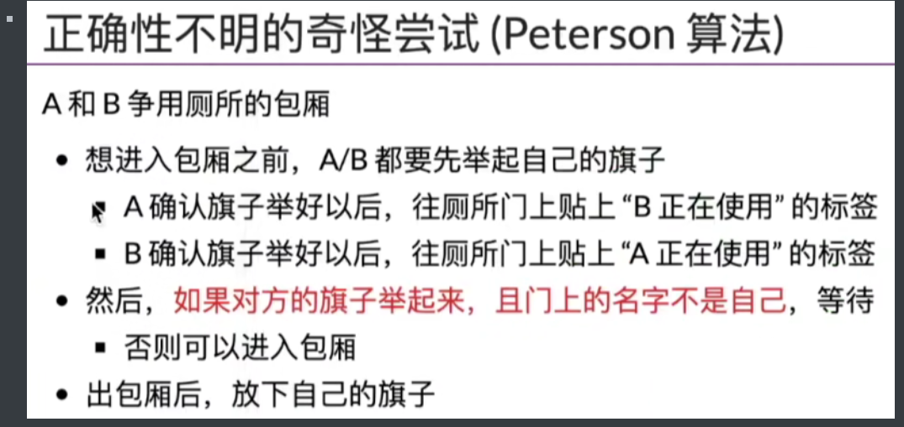
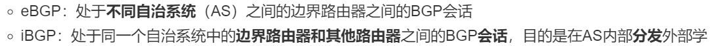
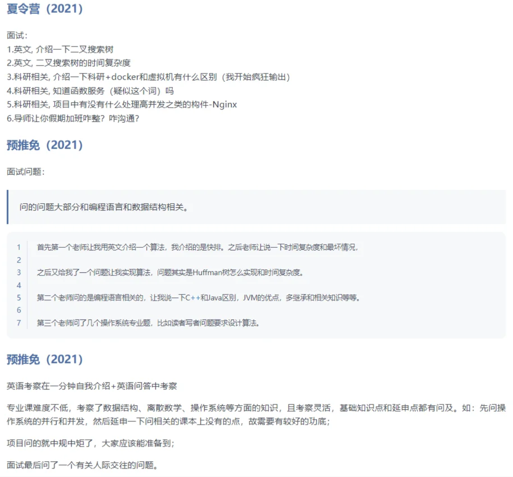
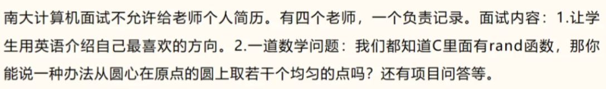

[TOC]


***

## 笔试



剩下的再过一遍os那边

***

* 


## **prim 和 kruskal**：

**1.prim的实现**：与dijkstra很像，只有在表示距离的dis数组上有如下区别：


具体的话，dis一开始记录的是各个点到起点的距离，然后每往集合里加一个点u，就比较剩下没有加入的点v的G [ u ] [ v ]和dis[v]的值，更新为最小值

* 算法主要与顶点数有关，因此适合边数多的，即稠密图
* **时间复杂度：O(n^2)**


**2.kruskal的实现**：


其中：判断是否连通：**使用并查集**，直接将边按从小到大排，然后一次大循环，每条边判断是否边的两个顶点不连通，即可

* 算法与边数相关，因此边越少越快，即稀疏图
* **时间复杂度：O(eloge)**


**二者都可以用堆来优化**


dijkstra：O（n^2^）

Floyd：O(n^3^)

Bellman：O(ne)，n为顶点数（循环n-1次），e为边数


B树：叶子结点表示没找到，m阶代表每个结点最多m个分支（m-1个关键字），最少m/2向上取整个子树，添加元素：分裂成三部分，中间加到父结点

B+：叶子结点是所有的数据，中间结点只是区间的最大值，两种遍历方法


时间复杂度：nlogn一般都是每次要遍历n个元素，每个元素要比较深度次数次（n元素二叉树的深度是logn级别的）

冒泡的O(n)：第一遍扫描完没改变，直接退出

空间复杂度：快排为递归栈的个数，归并为递归+临时数组（取较大的那个就是n），堆排只用了常数个辅助单元

稳定性：**直接插入、冒泡、归并、计数、基数**是稳定的，其余都是不稳定

***

**大端就是按照地址正常阅读顺序来写入数据；小端就是逆序**


* **cache内部**统一是  tag + 数据，其中数据对应一块（即一页）

* 直接映射和组相连映射很类似，**主存地址都是tag+行号/祖号+块内地址**，都是先通过中间的号去cache中找，然后比较tag来判断是否在cache中，在的话直接用**块内地址和cache数据来获取对应的数据**；全相连就是单纯的tag+块内地址，直接比较整个tag
* 


注意**有效位+脏位**


MEM和WB的区别：MEM针对内存（可能利用EX中的结果地址，来取得为WB中寄存器写回的最终值），EX针对寄存器


指令流水线那里bubble像这样插入：


***


先通过上面的式子算出r的位数，然后在1,2,4,8,... 这些位置上插入校验位，最后把剩下的数据位放好，如下，P是校验位，D是数据位：


然后把每位分解成1+2+4+8+..的形式，校验位上的数就等于：对所有用到该校验位**位置**对应的数进行奇偶校验（看题目要求），然后补全0或者1。偶校验的话，就是其余所有位相异或（注意：D1那里对应的是4+1，不是4）


出错的位置：例如P1，P4出错，那么就是8+1 = 9，即第9位有问题


校验和：

计算：当做16bit的数字，相加（最高位进位回加到最后一位上）后取反，得到的就是校验和

检验：操作同上，最后得到的和（不取反）如果为FFFF，就是正确结果


CSMA：


ipv4：


ipv6：


端口：


无线的可能问题（下面两个图）


频道划分：TDMA，FDMA，CDMA


路由交换容量：端口数量*每个口速率


ip数据报：


路由转发算法


IGP：RIP，OSPF

EGP：BGP（path vector）




多播：224开头的那些，仅应用于UDP（TCP是一对一）

IGMP（组群管理协议）

**多播协议：DVMRP（基于RIP），MOSPF（基于OSPF），PIM**


Qos：

* ISA
* DS

流量调度算法：

* 漏桶：恒定速率，缓冲区进行稳定
* 令牌桶
* 加权公平队列


对称加密：凯撒


***

**21年那张卷子**

操作系统，从jyy课那边往下再过一遍（加上上面的PV操作）


***

进程是process！！

***


8KB，客户端

***


显示器和键盘都是字符设备；D对

A不对吧，可以对应虚拟设备、内部设备等

B不对（大部分），C不对（大部分），EF错


AC不对？？？

***


A不对？对应的是打开的文件

B对，C对，

D不对：fork或者dup复制的都共享偏移量

E对？权限搞好就行？见下面还有这题

F对，使用dup或者fcntl

***

刷题：https://blog.csdn.net/weixin_45651194/article/details/125531888

1. malloc不是系统调用（管理的是用户内存，不是内核内存）
2. 

***


2. 父子进程文件共享以及写时拷贝

   

   
   
3. 

***


***


C吗，对的

***


选择题学会特殊值！！！！

根据：边的数量 = 点的数量 - 1


***


***


***


***


选B

***


见操作系统那里

https://blog.csdn.net/m0_74105867/article/details/135247231

***


这里是不是要给出页表项的大小？**留有疑问**

***


***


https://blog.csdn.net/u014470361/article/details/83591513

***

**磁盘调度算法**：

* FCFS：先到先得
* SSTF：最短寻道
* 电梯调度：扫描

**页面置换算法**：

* FIFO
* LRU
* OPT
* RR（这边具体看os那里了）

**进程调度算法**：

* 


进程间通信：

https://blog.csdn.net/qq_34827674/article/details/107678226

***


程序运行时cache和主存、TLB和页表之间的关系


***

死锁的必要条件：

互斥、占有并等待、非抢占、循环等待

***

解决race condition的4个必要条件：


***


***


***


***


Major，Minor，BuildNum，Revision

* 可以只有前两个，但一旦有revision，就要有buildnumber
  * 每个部分都必须 >= 0

* Major：主版本号，表示经过了大量重写（重大修改），无法实现向后兼容；更改时Major+1，其他重置为0
* Minor：次版本号，表示增加了功能或者进行了修正，可以向后兼容；更改时Minor+1，Revision重置为0
* BuildNumber：编译版本号(内部版本号)，更改处理器、平台、重编译时自动生成，非人为制定
* Revision：修订版本号，进行了局部修改或者bug修正时，修订版本号+1
  * Hotfix：后两者不同时可被称为修补(hotfix)

常见格式：major.minor[.revision [.build] ]

* 例如1.2.1 build-13124

***


***


***


***


***


区分分支节点和叶子结点

***

CR0~3号寄存器的作用

* CR0：含有控制处理器操作模式和状态的系统控制标志
* CR1：保留
* CR2：存放page fault的虚拟地址
* CR3：存放进程的页目录表基址，切换进程CR3会改变

同时，mmap的实现机制（发生缺页时才真正分配内存）：https://mp.weixin.qq.com/s?__biz=MzUxNDUwOTc0Nw==&amp;mid=2247484225&amp;idx=1&amp;sn=33ea64a034783794a4626c075135c81b&amp;chksm=f9459d9dce32148b021ce4734a271fb413a65fdfdae5d7033519f36e88756a1e1c07b5edcf4a&amp;scene=21&poc_token=HD8pO2ajYhNLmVFhlzA2uTPZqYUkVkdfVchsr8KC

***


***


***


***


**== == == =    把常见的一些参数都找下看下   == == == =**

对着这个网址看：https://www.cnblogs.com/cdy0626/p/12634434.html

***


***

中断响应流程：


这题答案很不确定


***


面向对象、程序设计、c++、java、jvm考点


收藏的jyy笔记也再看一遍


**多继承与虚基类**

* **多继承**：使用多个基类的继承

  * 公有多继承（public）：

    * 问题

      * 1. 从两个或更多相关基类那里继承同一个类的多个实例
      * 2. 从两个不同的基类继承同名方法

    * **虚基类**：

      * 使得从多个类（它们的基类相同）派生出的对象只继承一个虚基类对象，即virtual public

        * 即：虚基类只能被实例化一次

      * ```c++
        // Waiter声明为虚基类继承
        class Waiter : virtual public Worker {
            // TODO: do something
        };
        
        // Singer声明为虚基类继承
        class Singer : virtual public Worker {
            // TODO: do something
        };
        ```

      * 基类是**虚**的时候，**禁止信息通过中间类自动传给基类**

      * 如果下面的代码中，不额外写Worker(wk)，则会使用**默认构造函数**来构造虚基类对象

      * 如果不希望使用默认构造函数来构造虚基类对象，则需要**显式地调用所需的基类构造函数**，如下：

      * ```c++
        // 1、本示例代码显式的调用构造函数Worker(const Worker&)
        // 2、这种用法是合法的，对于虚基类必须这样做；对于非虚基类，则是非法的
        SingingWaiter(const Worker& wk, int p = 0, int v = Singer::other) : Worker(wk), Waiter(wk, p), Singer(wk, v) {}
        ```

    * 二义性：**两个虚基类的派生类（当前类的父类）中都有对虚基类同一方法的重写**

      * 解决方法：

        * 1. **加上作用域分析符**

          2. 在该类中重新定义该方法，并在函数体中指出使用哪个直接基类的函数，如：

             ```c++
             void SingingWaiter::Show(){
                 Singer::Show();
             }
             ```


***

**面向对象编程、函数式编程、命令式编程**

见离散数学那里


***

## 面试 

过了再看（还是一样，**把收藏夹先过一遍**）


***


***


***


注意  **稠密 和 稀疏**  那里

***


**多继承，这个要记得看看！**

**多继承与虚基类（上面）**


***


局部变量分配在栈区，全局变量分配在自由分配区

static的作用：1.隐藏（别的文件中不可见）；2.保持内容的持久性

***


***

c++：new和malloc的区别

* new：从自由存储区上分配空间；malloc：从堆上分配空间
* new在调用时会创建一个新的对象（同时调用构造函数），malloc只是分配空间
* new不可以直观简单的扩充容量，但是malloc可以 ( realloc )

malloc给你的就好像一块原始的土地，你要种什么需要自己在土地上来播种

而new帮你划好了田地的分块（数组），帮你播了种（构造函数），还提供其他的设施给你使用:

***


***

数据库：4NF等内容？

***

IPv6出现的动力是什么，报文头哪些字段发生了改变

***


***


***


***


软工专业的话，可能还是要大概准备下软件工程相关的问题、以及数据库相关问题ACID、范式啥的

***


***

概率论和线代，都去看下常见的面试问题有哪些

***

！！！！！！这个再全部过一遍！！！！！！！

https://blog.csdn.net/echoliuy/article/details/121023812

***


等概率取点：theta和fai随机，然后半径随机为(0,8)，其中0 ~ 1映射到0 ~ 0.5上， 1 ~ 7映射到0.5 ~ 1上

数据结构：邻接矩阵？

***

B树，B指的就是Balanced，以及B树的分裂（结点个数超过约定个数之后，分裂出新的子节点）


​	







**P问题和NP问题**


***

## 机试


**树的前序后序遍历，重点看看**

​	


***

## 经验

熵的定义

快速幂，以及矩阵快速幂
