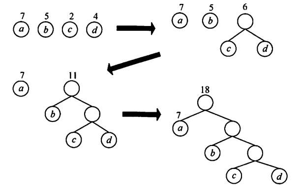

[TOC]

***

## 线性表

* 顺序表

* 链表

  * 静态链表

    

  * 循环双链表（单链表类似）

    

***

## 栈、队列、数组

* 栈 & 队列

  * 都是线性结构

  * 共享栈

    * 

  * 循环队列：

    * 定义front和rear指针

    * rear指向最后一个元素的后一个

      

  * 栈的应用：后缀表达式

    

* 数组

  * 特殊矩阵的压缩：找规律，求前面有多少个即可

    

    

***

## 串

* 模式匹配：KMP算法（后续再看是否特别重要）

***

## 树与二叉树

* 结点的度：孩子的个数

  树的度：结点的最大度数

  结点的分支：度

* 区分 完全二叉树 & 满二叉树

* 树的性质：

  * 有n个结点 —— 有n-1条边

  * **树中结点数 = 所有结点度数之和+1 = 总分支数 + 1**

    

    

    

* 二叉树

  * **二叉树的性质**
    * **非空二叉树上的叶子结点数 = 度为2的结点数 + 1**
    * 非空二叉树上第k层最多有2^(k-1)个结点
    * 高度为h的二叉树至多有(2^h) - 1个结点
    * 
    * 
  * **善用总结点数为 n0 + n1 + n2，且n2 = n0-1（只有分支为2的结点才对叶子结点个数有影响），且在完全二叉树中，n1要么为1，要么为0**

* 线索二叉树

  * 若无左子树，令lchild指向其前驱结点，同时设置ltag为1； 

    若无右子树，令rchild指向其后继结点，同时设置rtag为1；

* 树、森林
  * 树转换为二叉树：每个结点的左指针指向它的第一个孩子，右指针指向它在树中的相邻右兄弟
  * 森林转为二叉树：跟上面相似

* **哈夫曼树**
  * 带全路径长度WPL：所有叶结点的带权路径长度之和
  * 哈夫曼树：n个带权节点的二叉树中，WPL最小的二叉树
    * 特性：只有度为0和度为2的节点：n0 = n2 + 1
      * 因此：叶子结点数 = （总结点数 + 1）/ 2
    * 构造：
  * 哈弗曼编码：是变长编码，如下
    * **前缀编码**：没有一个码是另一个码的前缀
    * 注意统一左小右大，类似查找树
    * 构造：

* **并查集**
  * 一种简单的集合表示，每个结点初始时指向自己
  * 作用：可用来判断连通性、图的算法等
  * 父结点和祖先：父结点是结点指向的结点，祖先是父节点的父节点的...的父节点（直到指向自己）
  * 同一个祖先的孩子就是同一个集合里的点
  * 两个操作：并和查
    * **并**：让一个集合的祖先指向另一个集合的祖先
    * **查**：查询是否在同一个集合内：即是否为同一个祖先
    * 路径压缩：本来查询为O(n)，多次查询为O(n^2)，但是只要每次查询时递归地让自己的父节点变为祖先，则之后的查询都为O(1)，如下图中的操作所示：

***

## 图

* 定义

  * 有向图 & 无向图

  * 完全图：分有向和无向

  * 子图

  * 连通、连通图、连通分量

    * 连通分量：极大连通子图

    

    * **图是非连通图，最多可以有多少条边？—— n-1个结点的完全联通图和另一个点**

  * 强连通图：有向图，且任何一对顶点间强连通（v->u且u->v都有路径）

    * 强连通分量：极大强连通子图的集合
    * 在无向图中讨论连通性，在有向图中讨论强连通性

  * 连通图的**生成树**：包含图中**所有顶点**的一个极小连通子图

    * n个顶点，则生成树有n-1条边（不一定是权值最小的边）
    * 因为只有n-1条边且包含所有顶点，因此**一定没有环**（**多加1条边就有环了**）

  * 度、入度和出度（后两个对于有向图而言）

  * 回路：第一个顶点与最后一个顶点相同的路径

  * 简单路径：顶点不重复出现的路径

  * 简单回路：除第一个顶点和最后一个，其余顶点不重复出现的回路

  * 距离：顶点u到顶点v的**最短路径**的长度

* 图的存储

  * **邻接矩阵**：

    * ​	带权图：

  * **邻接表**：

    

* 图的遍历

  * 二者的性能分析：要取决于**存储的结构**：邻接表：O(V+E)；矩阵：O(V^2)
  * 广搜：BFS —— 类似层序遍历
  * 深搜：DFS —— 类似前序遍历

* **最小生成树**

  * 一个带权连通无向图中，权值之和最小的生成树

  * 最小生成树算法：Prim & Kruskal算法

    * Prim：每次选取与顶点集合距离最近的**顶点**，并加入集合，直到顶点数为总顶点数

      

    * Kruskal：每次选择权值最小且**落在两个连通分量**的**边**，加入顶点集合，**直到连通分量数为1，或者边为n-1**

      

  * **最短路径算法**：

    * **Dijkstra**：解决**无负权值**的**单源**最短路径问题

      * 每次从**未选择的顶点集**中选择一个到源点距离最短的顶点，加入集合，并优化集合中的其他距离，举例如下（表格要纵着看，从左往右）

        

      * 不能带负权的原因：负权可能会使得原先的最短路径长度变的更小，但是dijkstra不能更新已经定过一遍最短的长度了，例如上面第一列的5，假如之后有5-1=4，也更新不了4了

    * **Floyd**：解决**无负回路**的**全源**最短路径问题（可以带有负权值）

      * 对于每个顶点i，遍历每个顶点j，若存在顶点k，使得k作为中介时顶点i和顶点j的当前距离缩小（i到k的最短距离+j到k的最短距离 < 当前i到j的最短距离），则用k作为i，j的中介点，同时设置该距离为新的ij间最短距离

        

        

    * **Bellman-Ford**：解决**有负权值**的**单源**最短路径问题

      * 初始时所有点置无穷（表示到源点的最短距离），源点处值记为0，对所有边进行（顶点数-1）轮的操作，每轮操作都遍历所有的边，如果经过该边(u->v)可以使得源点到顶点v的最短距离变小，则在顶点v上更新这个最短距离（松弛）
      
      * 因为每次都要遍历所有边，因此可以解决负权的问题
      
      * 与dijkstra的区别：
      
        
      
    * **对三者的更好的解释**：https://zhuanlan.zhihu.com/p/432674874
  
    * 
  
    * Floyd：对于每个顶点k进行遍历，然后内部ij两个循环，如果k可以松弛i到j的距离，就更新距离（也是考虑了所有情况，因此可以负权值）
  
  * 拓扑排序
  
    * AOV网：（注意**边上无权值**）
  
      
  
    * 性质：每个顶点只出现一次，且若序列中A在B的前面，则图中不存在从B到A的路径
  
    * 构造如下
  
      
  
  * 关键路径
  
    * AOE网：同AOV网，但是边上有权值，记为活动的开销
  
    * 仅有一个入度为0的店：源点，工程的开始
  
      一个出度为0的店：汇点，工程的结束
  
    * **事件：顶点；活动：弧**
  
    * 关键：事件的最早/晚发生时间 ve和vl，活动的最早/晚发生时间 e和l
  
      * ve：表示所有可能的都已经完成后的时间，实际是从左到右的最迟(max)
      * vl：表示保证后面的都能发生时，事件最迟的时间，实际是从右到左的最早(min)
      * e：等于起点的ve
      * l：等于终点的vl-弧的时间
      * 关键路径就是 e = l 的结点的路径
  
      

***

## 查找

* 平均查找长度ASL：所有查找过程中进行比较次数的平均值

* **顺序查找**（线性表）：

  * 成功的ASL：(1+2+...+n)/n = (n+1)/2
  * 失败的ASL：n+1

* **二分查找**（有序的顺序表）：

  * 注意区间定义清楚，是左闭右开还是左闭右闭
  * 对应的二叉树是一颗**二叉排序树**
  * 成功的ASL：画成二叉树后，每个结点*路径长度，然后求和
  * 失败的ASL：计算失败的区间而非结点（注意计算的是与结点比较的次数）
  * 
  * 

* 分块查找：

  * 数据分成n块，每块中记录起始位置和块中最大值
  * 块间有序，块内无序
  * 

* 树形查找

  * BST：二叉排序树

  * 平衡二叉树：左右子树高度差绝对值<=1的二叉排序树

    

    * 对这个公式的理解：根（1）+ 左子树最小结点值（n~h-1~）+ 右子树最小节点值（n~h-2~），因为左右子树高度还可以差1

  * 插入：插入后调整，之后分为LL，RR，LR，RL平衡旋转（**暂时先略**）

  * 红黑树：略

* ## B树和B+树

  * B树：多路平衡查找树

    * **m阶B树：每个结点最多m棵子树（最多m-1个关键字）**，最少m/2向上取整棵子树

    * **注意m阶b树并不是一定要有一个结点有m个子树！**

      

    * 叶结点对应失败的位置

    

    * 构造过程：

    * 插入的算法：

    * 

      

  * B+树

    

* 散列表

  * 前面的查找都是建立在<比较>的基础上的，效率取决于比较次数

  * 散列表是直接将关键字映射为对应地址的方法：查找的时间复杂度为**O(1)**

  * 冲突：不同关键字映射到同一地址

  * 常用的散列函数

    * 直接定址 H(key) = a * key + b
    * 除留取余 H(key) = key % p

  * 处理冲突

    * 为产生冲突的关键字寻找下一个空的Hash地址

      * **开放定址法**：H = (H(key) + di) % m，其中di为增量序列，有如下取法

        * 线性探测：顺序查看下一个，即di = 1, 2, 3, ...       ——  可能导致堆积
        * 平方探测：di = 0方，1方，-1方，2方，-2方，...
        * 双散列
        * 伪随机

      * **拉链法**：用一个线性链表存储所有的同义词，然后在同义词链中查找即可

        

  * 性能分析

    * 仍然是使用ASL来判断性能优劣
    * 填装因子α：表中记录数 / 散列表长度
    * ASL与α直接相关

  * 删除元素：

    * 对于开放定址法：需要做删除标记
    * 对于拉链法：可以直接删除

***

## 排序

* 稳定性：关键字相同的两元素在排序前后的顺序关系不变，则称算法有稳定性

  

* 内部排序：排序期间元素全部存放在内存中

  外部排序：排序期间元素无法全部同时存放在内存中

* 插入排序
  * 直接插入：
    * 
    * 
    * 
    * 对基本有序的序列很好使——完全有序时：只用比较一次，且不用额外移动
    * 时间复杂度：O(n^2)
  * 折半插入：
    * 对前面的有序序列用折半查找找到插入位置，然后直接将插入位置后的所有元素右移1个
    * 时间复杂度：O(n^2)    因为移动次数未改进
  * **希尔排序**
    * 每次递减地取一个小于n的步长d，将n个数分为d组，各组间直接插入排序；然后取递减的d'，重复操作，直至d = 1，再进行最后一次直接插入排序
    * 

* 交换排序

  * 冒泡排序

    * 每次比较相邻两个，直到比较完。一共**最多**进行n-1次（只要有一次比较完后没交换，就提前结束）
    * 时间复杂度：O(n^2)

  * **快速排序**

    * 基于分治法：

      

    * 不必每次进行实际的交换，只需要将i和j之间来回复制，直到ij相等时，将pivot赋值给i即可

      

      

    * 快排是所有内部排序算法中平均性能最优的

      * 实际上就是转化为一个递归树，递归次数就是递归深度：
        * 性能最好：每次pivot都均分，二叉树，log2,n
        * 性能最差：每次pivot都是最大最小值，单链表，n

    * 空间复杂度：O(log2,n)，因为用了递归，实际上是递归栈（上面）的大小，即递归深度

    * 时间复杂度：O(nlogn)，因为找位置是n，递归是logn，所以是nlogn

    * 下面两点特性：

      

      

* 选择排序

  * 简单选择排序：

    * 每趟排序都选取关键字最小/最大的元素，放到有序子序列的最后面，直到结束

  * **堆排序**：

    * 堆的定义

      

    * 每次输出堆顶元素即可

      * 问题：如何构建初始堆；输出后如何调整剩余元素

      * 结论：每次每个子树进行一次调整（大顶堆就是选择孩子中较大的那个与之交换）

        输出元素后，将堆底元素送至堆顶，然后重新调整堆，可视化如下：

        

      * 插入操作示例：

        

      * 堆排序适合用于类似 **n个数中选出前m个数** 之类的问题

      * 空间复杂度：O(1)，只用了常数个辅助单元

      * 时间复杂度：O(nlog2n)，排n个，每个要经历深度次数的移动

* 归并排序和基数排序

  * 归并排序：每次将m个有序表合成为一个新的有序表，直至最后只剩1个有序表

    

    * 时间复杂度：nlog2n
    * 空间：O(n)

  * 基数排序：再看是否要看

    * 基于关键字各位的大小比较的，而不是直接比较关键字

* 各算法比较

  

  * 总结：能转化成树的——时间复杂度都是nlog2n
  * 总结
    * n不大时，使用直接插入、冒泡、简单选择
    * n中等时，希尔
    * n很大时，快排、堆排、归并、基数排序，前两者不稳定，后两者稳定

