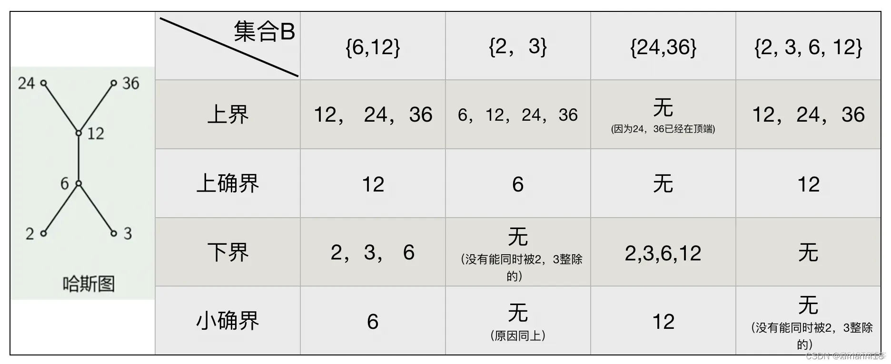
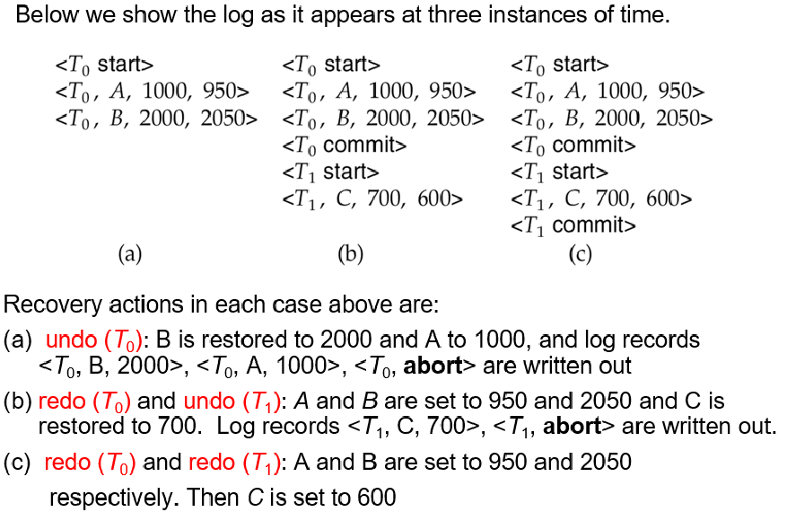
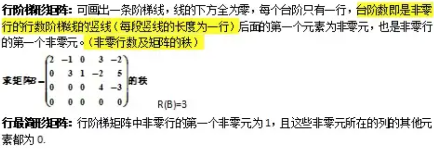

[TOC]

***

## 离散：Discrete Mathematics

* **谓词：（再看）**

* **极小项**：每个元素与其否定中的一个的合取（倒V），就是**且**
  * **极大项**：...析取（V），就是**或**
  * 主合取范式：析取式的合区
  * 主析取范式：合区式的析取
* 集合
  * 幂集：集合的全体子集构成的集合，n个元素->2^n个元素
  * 笛卡尔积：各元素相乘后全体构成的新的集合

***

* 映射

  * 单射：x1 != x2，y1 != y2
  * 满射：对所有y属于Y，都有x使得f(x)=y
  * 双射：一一对应（即单射+满射）

* **二元关系**性质

  

* **等价关系**（其中R代表某种关系）

  * 自反(aRa)、对称(aRb -> bRa)、传递(aRb, bRc -> aRc)
  * 举例：无向图的连通关系就是等价关系

* **等价类**：R是A上等价关系，相互等价的元素构成的A的若干个子集即为等价类

  * 商集：等价类的集合
  * 划分：商集（A/R）是A的一个划分，称为由等价关系R导出的划分

* **偏序**

  * <=（自反，反对称，传递）

  * 逆序：<（反自反，非对称，传递）

  * 偏序集：使用哈斯图来表示，例子如下（偏序关系是“整除”）：

    

* 最小元、最大元、极小元、极大元（对于偏序集来说）

  * 上图中（考虑所有元素时），没有最大最小元（要求要唯一），极大元为24和36，极小元为2和3

* 上界、下界、上确界、下确界（对于偏序集来说）

  * 集合的所有上面的元素都是上界，最直接的上界就是上确界

  * 例子如下：

    

* 自然映射：
  * 把a映射到a的等价类
  * 自然映射一定是满射

***

* **握手定理**：
  * n个人，每人握手x次，总握手次数：nx/2
  * 用于说明任何图中所有顶点度数和 = 边数 * 2

* 图的阶：图的顶点数
  
* 补图：两个拼起来是完全图
  
* 平凡图：只有一个顶点
  
* 悬挂顶点：度数为1
  
* 平行边：一对结点间的两条边
  
* 简单图：不含环，不含平行边
  
* **二部图**：顶点集可以划分成两个不相交的子集，使得图G任何一条边的两个端点一边一个
  * **判别：没有长度为奇数的回路**

* **欧拉回路/通路**：经过图中每条边一次且仅一次并且行遍图中每个顶点的回路（通路），成为欧拉回路（通路）
  * **欧拉图**：存在欧拉**回**路的图
  * 判别有**欧拉回路**：
    * 无向图：连通且没有奇度顶点（想一下就明白了）
    * 有向图：连通且所有顶点入度 = 出度（同上）
  * 判别有**欧拉通路**但没有回路：
    * 无向图：连通，2个奇度顶点，剩余偶度顶点
    * 有向图：连通，1个顶点出度 - 入度 = 1， 1个顶点入度 - 出度 = 1

* **哈密顿回路**：经过图中每个顶点一次且仅一次的回路（通路）称为哈密顿回路（通路）
  * **哈密顿图**：存在哈密顿回路的图
  * 判别：暂无

* **平面图**：没有边相交
  * 满足欧拉公式： n - m + r = 2，n为顶点数，m为边数，r为面数
  * m <= 3n - 6
* 图的度和边的关系：
  * 有向图：边 = 入度 = 出度
  * 无向图：边 = 度/2

* 连通分支
* 无向图：
  * 任意两点都连通：连通图；
  * 否则：非连通图
* 有向图
  * 忽略方向得到的无向图是连通图：弱连通
  * 不忽略方向，任意两顶点都相互可达：强连通

* 点割集：删去点割集中所有顶点，得到的图的连通分支数大于原来的；不删所有的，就是=
  * 点割集只有一个顶点：割点
* 边割集：删去边割集中所有边，得到的图的连通分支数大于原来的；不删所有的，就是=
  * 边割集只有一条边：桥

* 图的同构：
  * 两个图中可以找出对应关系，使得对应点的度数全部相同

* 最小生成树算法：Prim（加点） &  Kruskal（加边）
  * prim：稠密，用堆来存
  * kruskal：稀疏，可以用**并查集**（判断是否连通）
  * 都可以使用**优先队列**，来获取最小的值

* **最短路径算法：Floyd，Dijkstra（念成dicks tra），Bellman-Ford**

* **树：连通且不含回路的无向图**

***

**代数系统**：非空**集合A**和A上的k个**封闭的运算**组成的系统

**代数系统间的关系**

* 同构：两个代数系统之间的元素都是一一对应的，即完全相似
* 同态：不要求一一对应

**含一个运算的代数系统：群类**

* 广群：**封闭**

* 半群：**封闭+可结合**
* 独异点：又称为含幺半群（**封闭+可结合+存在幺元**）

* **群**的定义
  * 对于一个**代数系统<G，*>**
    * **封闭**：对于a，b∈G，有a*b∈G
    * **可结合**： (ab)c = a(bc)
    * **存在单位元**：存在e，使得ea = ae = a
    * **任意元素对*可逆**：任意a，存在b，使得ab = ba = e，e为单位元
  * 可用于解决染色问题，项链问题等
* 循环群：
  * 

​	

**含两个运算的代数系统**

* **环**
  * <R，+，* >：<R，+>为可交换群，<R，* >为半群，且 * 对+满足分配律
  * 整环：环，且可交换、含幺元、无零元
  * 除环：环，有幺元，无零元，逆元也在环中
* **域**
  * <R，+，->既是整环又是除环，则称R是域（**即加法乘法都是交换群**）
* **格**
  * 对于偏序<S，<=>，若任意x,y∈S，{x, y}都有最小上界和最大下界，则称为格
  * **布尔代数**：有补分配格称为布尔格，由布尔格诱导的代数系统<A，∩，∪，非>称为布尔代数

***

命题逻辑的连接词：

* 一元：非
* 二元：合区、戏曲、异或、蕴含->、等价<->

***

## 编译原理：Compilation principle

（上图是同济的，还包括：简述编译过程，first、follow集）

***

* 4个步骤：预处理、编译、汇编、链接

* 其中：编译包括的步骤：
  * 词法分析：只识别记号（不检测错误）
  * 语法分析：生成语法树，判断是否有语法错误（少括号，少分号这种）和词法错误（非法关键字、标识符等）
  * 语义分析：判断语义是否合法（看有没有静态语义错误（类型不一致、参数不对）和动态语义错误（死循环、除0）等）
  * 中间代码生成
  * 代码优化
  * 目标代码生成

***

### 词法分析：

* 正规式与正规集：
  * 正规式：一个表达式
  * 正规集：正规式对应的所有结果的集合
* *闭包，+闭包，？
* S的前缀、后缀：可以为空也可以等于S
  * 真前缀/后缀：不能为空，也不能等于自己

* **NFA 和 DFA**
  * NFA：不确定的有限状态自动机
    * 初态不唯一
    * 可以有多个下一状态转移
    * 可以有空转移
  * DFA：确定的有限状态自动机
    * 初态唯一
    * 没有空转移
    * 最多有一个下一状态
* 构造NFA（thompson算法）
* NFA -> DFA：
  * 根据NFA计算epsilon闭包，来获取DFA中不同的状态
  * 最小化DFA：分为 初态集 和 终态集，然后不断划分状态（每次根据某个字符，看状态间的转移关系）
  * n个state的NFA，变为DFA最多有2^n个state

***

### 语法分析：

* 上下文无关文法CFG：
  * 即：-> 的左边只能有一个非终结符（唯一）
  * 如果为：aSb -> aasbb，这就是上下文有关了

* 二义文法：
  * 若一个文法可以对应两颗不同的分析树，则可以证明该文法是二义的

* 分析树 & 语法树
  * 区别：分析树内部节点是非终结符；语法树内部节点是操作符（运算符），例子如下：
  * 

* **自上而下语法分析（移进）**：

  * 前置动作：

    * 先消除左递归
      * A -> Aa | b
      * 改成：A -> bA'；A' -> aA' | epsilon
    * 然后提取左因子

  * LL1文法：

    * L：左到右扫描；L：最左推导

    * 条件：**预测分析表不含多重定义的条目**（即**每次都确定只有一条路可以走**）

      * 因此一定不是二义文法
      * 因此一定不含左递归和左因子
      * 因此候选项的First集不相交
      * 因此有epsilon时，First和Follow不相交

    * **求解FIRST集 和 FOLLOW集**

      * FIRST(A)表示A中可能出现的第一个终结符或者运算符

      * FOLLOW(A)表示A后面可能跟的第一个终结符或运算符

      * 例子如下：

        

    * 构建预测分析表

      * 规则：FIRST里的放进去，含epsilon的话，把FOLLOW里的也放进去

        

      * 另一个例子：

        

      * 另一个例子：

        

* **自下而上语法分析（规约），跟上面反过来**：
  * 句子、句型
    * S 推导出 a，则a是S的句型
    * **句型**：对于一个开始符号S，经过0~n次推导，期间生成的中间结果都是句型
      * 既可以包含终结符，又可以包含非终结符，也可能是空串
      * 对应一颗分析树的所有叶子结点的集合
    * **句子**：不包含非终结符的句型
  * 短语、直接短语、句柄
    * **短语**：分析树上某个子树的所有叶子结点构成的符号串
    * **直接短语**：树高为2的子树的短语
    * **句柄**：最左直接短语
  * 
  * 最左规约：把句柄替换为相应产生式的左部非终结符
    * 每次找到句柄，然后**剪句柄**即可
  * 活前缀：句柄的子集（可以包含句柄之前的），状态机每分析出一个句柄就进行规约
    * 例如：比如E+E * E归约成E+E，句柄是E * E，那么它的活前缀就是E、E+、E+E、E+E*、E+E * E
    * 比如id+id * id归约成E+id * id，句柄是最左边的id，那么它的活前缀是id，因为不能超过句柄
  * LR0文法：**不存在**移进/规约**冲突**或者规约/规约冲突
  * SLR1文法：可以存在冲突，但是冲突可以被解决
    * 构建SLR分析表：
      * 先构造识别活前缀的DFA
      * 然后填表，s代表移进，r代表规约，例子如下：
      * 注意规约看的都是推导符号左边的部分（如E->T.中的E的Follow集）
      * 
    * 另一个例子：
    * 
    * 解决冲突的含义：
    * 
    * 实现的细节：
      * 句柄总在栈顶形成
      * 栈中保留的永远是活前缀

***

### 静态语义分析

* 综合属性：子决定父
* 继承属性：兄弟和父决定自己

* 中间代码：三地址码、四元式等

* 三地址码 和 三元式
  * 
  * 
* 四元式：
  * 相对三元式，不再使用序号来表示运算结果
  * 

* 类型转换，见下面：
  * 
  * 

***

***

## 数据库：

* sql语句暂时不看了

* 数据库的分类

  * **关系数据库**：

    * 归结为二维表格形式
    * 使用了关系模型来组织数据

  * **非关系数据库**：

    * 使用键值对来存储数据

    

* **事务ACID特性**：
  * A：atomic，原子性：事务是原子工作单元，要么全执行，要么全不执行
  * C：consistency，一致性：例如对两边同时影响（赚钱后，A-，B+）
  * I：isolation，隔离性：不会被别的事务干扰
  * D：durability，持久性：对系统的影响是永久的

* 事务的冲突可串行化
  * 串行调度：T1做完了做T2
  * 并发调度：并发进行
  * 正确的调度：串行调度和可串行化调度
  * 冲突：出现WW，RW，WR的次序不同导致结果不同
  * 判断：
    * 画出调度S的优先图，对于每个A、B之类的东西，若两边出现WW，RW，WR，则画箭头
    * 若存在环，则不可冲突串行化，例子如下：
    * 

* 三个模式：
  * 外模式（用户模式）：用户见到的局部数据
  * 模式（逻辑模式）：数据库中的全体数据
  * 内模式（物理模式）：物理结构的存储方式

* 名词：
  * 超码：可以唯一识别一个关系的属性的集合
  * 候选码：最小的超码
  * 主码：候选码中的一个
  * 主属性：包含在任何一个候选码的属性
  * 非主属性：不包含在任何候选码的属性

* 关系模型：
  * 选择
  * 投影
  * 自然连接

* ER图
  * 
  * 转换为关系模式：
    * 1:1	任选一个添加到另一个的主键
    * 1:N   在N端添加另一端的主键
    * N:M  将该联系转换为实体，在该实体中添加另外两实体的主键 

* 关系数据库设计
  * 属性闭包：根据函数依赖集一步步推导即可（直到属性闭包与上次相同，或者包含所有属性）
  * 最小依赖集：略
  * 正则覆盖：（最小依赖集最后加了一步合并）
  * 函数依赖：
    * 非平凡的函数依赖：X->Y，且Y不是X的子集。例如 A->B
    * 完全函数依赖：X->Y，且X的任意真子集都不能推出Y。（X是推出Y的最小集合的感觉）
    * 部分函数依赖：非完全函数依赖
      * **例如：AB->C，A->C，则C部分函数依赖于AB，完全函数依赖于A**
  * 求候选码：
    * 1：L类和N类：只出现在左边，左右都没出现 —— 一定属于候选码
    * 2：LR类：左右都出现 —— 可能属于候选码
    * 3：R类：只出现在右边 —— 不属于候选码
    * 先求1对应的候选码的属性闭包是否包含所有元素，不的话就加上LR中的，直到找到长度最小的

* **范式**：符合某种级别的**关系模式**的集合（就是看那个**关系集**）
  * **1NF**：
    * 每个属性都不可再分
    * 例子如下：
    * 
  * **2NF**：
    * 是1NF，且每个非主属性都完全函数依赖于任意候选码
    * 例如：
    * 
  * **3NF**：
    * 是2NF，且不存在非主属性对码的传递性依赖，即候选码应该直接决定非主属性，而不是间接
    * 例如：
  * **BCNF**：
    * 是3NF，且所有决定因素（左边的）都要包含候选码
  * **4NF**：
    * 不允许有非平凡且非函数依赖的多值依赖（记为A->->B）
    * 即给定某属性一个值，剩下的属性之间**不存在多对多的关系**
      * **多值依赖**：X/Y/Z将集合分成三部分，对于确定的Y，如果给定任意的X，都仅有一组Y的值与之对应，而与Z的值无关，则有X->->Y
  * 1 ~ BCNF是基于函数依赖，4nf是基于多值依赖

* 并发控制
  * S锁：shared，只读请求（别的也可以申请s锁）
  * X锁：exclude，读写请求
  * 
  * **两段锁协议：2PL**
    * 分成上下两段，上面上锁，下面解锁
    * 可以保证串行化
    * 不能保证不发生死锁
  * 恢复系统
    * undo：未完成的事务，将修改的值复原
    * redo：已完成的事务，重做一次（恢复为新值）
    * 

* sql语句部分
  * grant / revoke：权限语句
  * 
  * 
  * 
  * 
  * 

* sql和主语言之间通信
  * sql通信区：sql向主语言传递执行状态
  * 主变量：sql使用的主语言的程序变量
  * 游标：sql产生的结果是多条记录的，使用游标来协调（相当于指针）
  * 

***

## 概率论：

* **互斥和独立没有关系**
* **独立一定不相关，不相关未必独立**

* **基本概念**
  * 古典概型：样本空间有限；样本点概率相等
  * 几何概型：样本空间无限
  * 先验概率 & 后验概率：P(B) 和 P(B | A)
  * **条件概率**：P(A|B) = P(AB) / P(B)，在B事件发生的情况下A事件发生的概率
  * **乘法公式**：P(AB) = P(A) * P(B|A)，可以继续叠下去
  * **样本划分**：互斥的子事件，和为整个样本空间
  * **全概率公式**：
    * 原因推结果
    * 
  * **贝叶斯公式**：
    * 用于某个现象A发生时，判断某个原因Bi引起的可能性的大小（结果推原因）
    * 
    * 这么理解：
      * 分母是P(ABj)求和，表示A发生的总概率（）
      * 分子是P(ABi)，表示A和Bi都发生的概率（乘法公式）
  * 事件独立性：
    * P(AB) = P(A) * P(B)
    * P(B|A)=P(B)
    * 

* **随机变量及其分布**
  * **概率分布函数（离散型）**：F(x) = P{X <= x}
  * **概率分布函数（连续型）**：F(x) = ∫ f(t)dt（负无穷到x）
    * 其中f(x)为X的**概率密度函数**
  * **离散型**：
    * **01分布**
    * **二项分布（n次01分布，有放回）：**
      * 
      * 记为：X ~ B(n, p)
    * **泊松分布**：
      * 
      * 记为：X ~ P(λ)
    * 几何分布（首次发生的概率）
      * 
    * **超几何分布（无放回）**：
      * N件里M件次品，取n次，取到次品的概率：
      * 
  * **连续型**
    * 均匀分布
      * f(x) = 1/(b-a)， X ~ U(a, b)
    * 指数分布
      * 
      * **无记忆性：P{X > s+t | X > s} = P{X > t}，即与以前状况无关**
    * **正态分布 / 高斯分布**
      * 
      * **标准正态分布**：N(μ, σ²)中的μ=0，σ=1
      * 改变μ，左右移动；改变σ，σ越大方差越大，越扁
      * 标准化：(X-μ)/σ ~ N(0,1)
      * 二维正态分布：两分量独立的充要条件为，ρ = 0

* 二维随机变量的边缘分布：
  * 联合分布函数F(x, y)
  * 边缘分布函数：Fx(x)，Fy(y)
    * 求法：让另一个值趋于+无穷
    * 边缘概率密度：fx(x) = ∫ f(x, y) dy，对y从负无穷积到正无穷

* **随机变量的数字特征**
  * **期望**
    * 离散：x*p求和
    * 连续：∫ xf(x)dx，对x从无无穷到正无穷
    * 性质：
      * E(C) = C
      * E(CX) = CE(X)
      * E(X+Y) = E(X)+E(Y)
      * E(XY)  = E(X)*E(Y)，当xy相互独立
  * **方差**
    * 就是E([X - E(X)]^2)
    * 计算公式：E(X^2) - E(X)^2
    * 性质：
      * D(C) = 0
      * D(CX) = C^2 * D(X)
      * D(X ± Y) = D(X) + D(Y)，XY独立
  * **常见的期望与方差**
    * 
  * **协方差**
    * 衡量两个变量的总体误差
    * Cov(X,Y) = E(XY) - E(X)E(Y)
    * Cov(X,X) = D(X)
    * 性质：
      * Cov(X,Y) = Cov(Y,X) 对称性
      * Cov(aX,bY) = abCov(X,Y) a,b为常数
      * Cov(X1+X2, Y) = Cov(X1,Y) + Cov(X2,Y)
      * 若X,Y独立，那么Cov(X,Y) = 0 （倒推不成立）
      * D(X±Y) = D(X)+D(Y)±2Cov(X,Y)
  * **相关系数ρ**
    * 
    * 绝对值<=1，绝对值越大越线性相关
    * 绝对值 = 1 ：存在a,b，使得P(Y = aX + b) = 1
    * 

* 总结：XY不相关 <--> Cov(X,Y) = 0 <--> ρ = 0 <--> E(XY) = E(X)E(Y)

* **大数定理和中心极限定理**
  * 切比雪夫不等式：
    * 
    * 
  * **大数定理：**
    * 独立重复事件、次数足够多的情况下：
    * **随机事件出现的频率近似等于概率**
    * 切比雪夫、辛钦、伯努利
  * **中心极限定理：**
    * **独立同分布**的大量随机变量，他们的**和近似趋于正态分布**
    * 随机变量的E = μ， D = σ方
    * 则**和近似服从于 N(nμ，nσ方)**，如下：
    * 

* **统计部分**
  * 样本均值：
    * 
  * 样本方差：
    * 
    * 注意是n-1，不是n！除以n的是**矩**
  * 对任意总体X，设E(X)=μ，D(X)=σ^2^，X1,X2,…,Xn是样本，则E(X平均)=μ，D(X平均)=σ²/n，E(S²)=σ²
  * **卡方分布：**
    * 
    * 性质
      * 可加性：设X1² ~ X²(n1)，X2² ~ X²(n2)，并且X1²与X2²相互独立，则X1²+X2² ~ X²(n1+n2)
      * 若X² ~ X²(n)，则E(X²)=n，D(X²)=2n
  * **上α分位数**：
    * 

* 参数估计：**最大似然估计**
  * **利用已知的结果，找出最有可能生成该结果的样本分布参数**
  * 无偏性、有效性、相合性
  * 写似然函数，取log，求导，解方程
* 置信区间：
  * 估计一个范围，使之以较大的概率包含未知参数
  * 在这个范围内达到某种可信程度
* 假设检验：
  * Z检验
  * T检验

***

## 线代：

* **行列式**
  * 特殊行列式
    * 上下三角行列式和**对角行列式**，满足如下：
    * 
  * 性质（行和列对等，下面只写行）
    * D = D转置
    * 交换两行，行列式变号
    * 两行相同，D = 0
    * 某行所有元素*k，等于用k乘这个行列式
    * 两行成比例，D = 0
    * 某行的元素都拆成两数之和，则D可拆成对应两行列式之和
    * 某行的k倍加到另一行，D不变
  * 余子式：去掉aij对应的行列后，剩下的行列式
    * **代数余子式**：
    * **行列式按行展开**：行列式 𝐷 等于它任一行（列）的各元素与其对应的代数余子式乘积之和
  * **范德蒙德行列式**：
    * 
    * 记n行就行

* **矩阵及其运算**

  * 增广矩阵：

    

  * 矩阵运算：

    * 矩阵的迹：主对角线元素的和

    * 加法：满足交换、结合律

    * 数乘：a * 矩阵 = 矩阵中所有元素 * a

    * 矩阵乘法：

      

      * 注意AB != BA

    * 转置：

      

    * 方阵的行列式：n*n阶矩阵对应元素构成的行列式

      * 
      * **方阵行列式的几何含义**：
        * 行列式中行向量构成的超平行多面体的有向面积或体积
        * **矩阵代表的线性变换对空间伸缩的比例**
          * **因此行列式=0，代表至少有一个方向被压缩到了0维度**
            * **因此变换不可逆（没有逆矩阵）**
            * **因此基底线性相关**
            * **因此秩 < n**

    * **伴随矩阵**：将aij替换为代数余子式Aij后得到的矩阵

      * 有

    * 逆矩阵：AB = BA = E，则B为A的逆矩阵

      * 
      * 
      * A转置的逆 = A逆的转置
      * | A逆 | = | A | ^ -1
      * **求A的逆矩阵的方法：**
        * **将A和E写在一起，形成新的矩阵(A，E)**
        * **对其进行初等变换，直到左边变成E，则右边就是A逆**

    * 克拉默法则：若线性方程组对应的系数矩阵的行列式!=0，则有：

      * 即每次让常数矩阵那一列替换第i列
      * 

* **矩阵初等变换与线性方程组**
  * **初等变换**（行列等价）：
    * **对换两行**
    * **非零数k乘一行上所有元素**
    * **某行的k倍加到另一行上**
  * 矩阵等价：A经过有限次初等变换变成B，记为AB等价，A~B
  * **矩阵的秩**：
    * 几何含义：基底张成的空间的维度（线性无关基的个数），因此有以下性质
      * 
      * 注意**行列式的值与秩的关系**：
        * 行列式为0，则基底线性相关，则秩 < n
        * 行列式不为0，则基底线性无关，则秩 = n
    * **行阶梯矩阵：**
      * 
      * 原理就是上面，**非零行数就是无关基的个数，就是秩的值**
  * 方程组的解的个数的判定
    * 

* **向量组的线性相关性**
  * **向量（组）B**可以被**向量组A**中的多个向量线性相加表示，则称B可以被A线性表示
  * 两向量组可以相互线性表示，称向量组等价，二者的秩相同
  * 向量组间的向量若可以相互表示，则称向量组A线性相关
    * 秩 = 向量组向量个数：线性无关；<：线性相关
  * **向量空间**
    * 相互线性无关的向量组成的向量组，称为**空间的基**

* **相似矩阵及二次型**
  * 向量内积：点乘
  * 正交：内积为0，两向量呈90度
  * **正交矩阵**：，即
  * n阶方阵A的**特征值**：
    * 作用：
    * 若对于n维向量x，有**Ax = λx**，则称A的**特征值**为λ，称对应于λ的**特征向量**为x
      * **特征根**：特征值的集合
      * 例子如下（回想下有**基础解系**这些东西）：
      * 
    * 即：一个方阵对一个向量的线性变换等价于拉长λ倍
    * **特征方程**：改写上式为
      * 有非零解的充要条件：线性相关，即 | A - λE | = 0 
      * **特征多项式**：**f(λ) = | A - λE |**
  * **矩阵相似**：
    * 相似对应的公式：
    * **几何意义**：AB矩阵相似，意味着两者表示的是，**同一线性映射在不同基下的表达**
    * 
    * 因此，**若A和B相似，则A和B的特征值相同**
  * 二次型：忽略

***

## **c++ & java**

### c++

* **四种类型转换**
  * static_cast：普通转换
  * reinterpret_cast：强制转换（任意转换）
  * const_cast：去除变量地址的const和volatile属性，从而间接修改const变量的值（原值不变（放在寄存器中），但是指针指向的值变化（内存中））
  * dynamic_cast：父类到子类
  * 
* **浅拷贝和深拷贝**：
  * 浅拷贝：简单的赋值拷贝
    * 可能带来：堆区内存重复释放的问题（直接拷贝指针）

  * 深拷贝：在堆区重新申请空间，赋值完成后，拥有独立的数据

* **多继承 & 虚基类，见复习要点那里**

**面向对象编程、面向过程、函数式编程、命令式编程**：

* 面向过程：以事件为核心
* 面向对象：以对象为核心
  * 与函数式编程的区别：
    * **函数式中，数据与方法是分离的**；oop中，封装在一起
    * 函数式避免了共享状态；oop可以改变和共享状态
    * 函数式更容易写并发
* 函数式编程：关注结果，将每个功能的实现封装到函数中
  * 特征
    * 函数为核心，可作为参数或返回值使用，**函数被视为一种映射关系**
    * 函数不修改程序状态或全局变量，只返回新的值
    * 强调数据不变性（数据一旦创建就不能改变）
  * 优点：可减少耦合，使用方便
  * 缺点：内部核心无法修改，操作不够灵活
* 命令式编程：关注过程，自己进行处理
  * 优点：处理数据量较大，性能好

### java

* **JVM的作用**：让java编译生成的字节码，通过JVM来解释执行为不同操作系统对应的二进制码，从而拥有可移植性
* java接口：就是虚类（且每个方法都是虚函数）
  * 接口：关键字interface
  * 实现：关键字implements（代替extends）
* 抽象类和接口的区别：
  * **抽象类**：“是不是”，**对事物的抽象**
  * **接口**：“有没有”，**对行为的抽象**
* 关键字：
  * **extends**：用于表示类的继承
  * **abstract**：用于声明抽象类
  * **final**：声明是常量，或无法被子类修改的方法，或无法被继承的类
  * try-catch-finally
  * **instanceof**：判断是否属于某个类型（**对extends和implements指向的类都生效**）
  * **super**：调用**父类**方法或字段
  * **synchronized**：保证在任意时刻，只有一个线程可以执行该方法
  * **volatile**：保证不同线程对该变量的可见性（一旦修改 ，所有线程均可见），~~注意与c++的不太一样~~
    * 保证不会对其进行重排优化，以及通过屏障保证一定从内存读，从内存写
    * **不能保证原子性**
  * c++的const：在java中变成**public static final**
  * **native**：表示只声明，实现由外部语言来完成
* 包装器
* 堆和栈：堆：放对象的空间，new；栈：放对象的引用，访问速度快
* 缓存池：以Integer为例，-128~127中的数，使用Integer.valueOf时每次都会返回同一个对象
* **正则表达式：regexp**
  * **元字符（有点像正则式）**
    * 
    * 

  * **简写字符集：**
    * 小写：word，digit，space
    * 大写：非
    * 

  * **标记：**
    * 
    * 使用时，用/ /来包围要标记的语句，在后面加上gi，gm等（3个可以相互叠加），例如

  * **断言**：多个判断前面或者后面的式子
    * 
    * ：the后面必须是空格+fat
    * ：the后面必须不是...
    * ：出现在The空格后面的fat或者mat
    * ：不出现在the空格后面的cat

* HashMap：就是unordered_map
* **JVM**：
  * **组织架构**
    * **类加载器**：加载类文件到内存中
    * **运行时数据区**：定义了运行期间需要用到的内存区域
      * 垃圾收集机制：主要针对**堆**

    * **执行引擎**：将字节码指令翻译为本地机器指令

