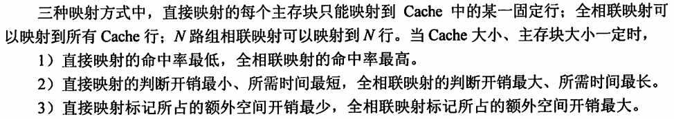
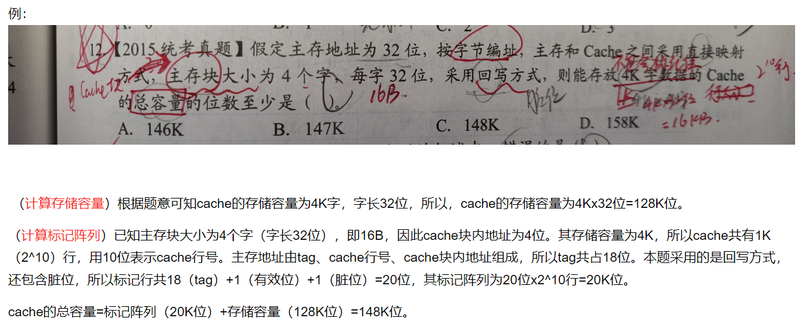

[TOC]

***

## 系统概述

* IR存放当前要执行的指令，PC存放下一条
* n位计算机：表示计算机字长为n位，即一次可以处理n位数据
* 字长：计算机进行一次整数运算所能处理的二进制数据位数
* 主频：越高，执行一个步骤的时间越短
* I：Instruct，指令
* CPI：执行一条指令花的时钟周期数/CPU时钟数
* MIPS：每秒执行多少百万条指令；MFLOPS：衡量计算机性能标准
* 

***

## 数据的表示和运算

* 进制转换

  * 2 转 8/16
    * 
  * 2/8/16 转 10
    * 
  * 10 转 2/8/16
    * 分整数和小数两个部分
    * 
    * 

* BCD码

  * 8421：若相加后大于等于10，则要加6修正

* 定点数

  * 定点小数：纯小数
  * 定点整数：纯整数
  * 

* 各种码

  * 真值：对应的真实的大小
  * 原码：最高位为符号，其余位表示数的绝对值
    * 字长为8位时
      * +0.1101的原码：0.1101000
      * -0.1101的原码：1.1101000
    * 优点：简单，乘除方便
    * 缺点：0不唯一，加减复杂
  * 补码：使得加减运算全部变成加法运算
    * 最高位权值为正/负，剩下的位权值全部为正（CSAPP里面的表示方法），使得最后结果等于真值
    * 字长为8位时
      * +1010的补码：00001010
      * -1101的补码：11110011
    * 0的补码唯一
    * 原码->补码：正数正常，负数：符号位1，各位取反，末位+1
    * 补码->原码：正数正常，负数：符号位不变，各位取反，末位+1
    * 补码->真值：上面的方法，或者先补码到原码，然后
  * 反码
    * 正数反码：与原码相同
    * 负数反码：符号位为0，各位取反
  * 移码
    * 用来表示阶码，码值越大的，真值就越大
    * 0的值为：100...0（n个0），其中机器字长为n+1
    * 例如：11111111表示的事+127，因为记住10000000表示的是0

* **运算方法和运算电路**

  * ALU：算术逻辑单元

  * 补码加法：a-b = a+[-b]补

    * [-b]补 = b补，连同符号位，整体取反后，末位+1
    * 判断溢出：一位符号位或双符号位
    * 双符号：先复制一个符号位变成双符号位
      * 10：负溢出；01：正溢出；11或00：不溢出

  * 乘除先不管了

  * 移位计算：

    * **算术移位**（记住负数对应的反码与原码除符号位都相反）

      

    * **逻辑移位**

      * 将操作数视为无符号数
      * 左移：高位丢掉，低位添0
      * 右移：低位丢掉，高位添0

* 有符号数与无符号数之间的转换

  * 强制类型转换的结果保持位值不变，仅仅改变了解释这些位的方式
    * 有符号：第一位是符号位
    * 无符号：第一位就是数值位
  * 大字长变量强制转换成小字长变量时，多余的高位直接被截断，低位直接赋值
  * 小字长变量到大字长变量：
    * 对于无符号：都是正数，直接在前面添0
    * 对于有符号：符号扩展，即高位0添0，高位1添1

* 数据存储

  * 对于01234567H这个int类型的变量：
    * 

* 浮点数表示与计算

  * 

  * 

  * 是否是规格化：

    * 原码编码的尾数：看第一位是否是1
    * 补码编码的尾数：看符号位和尾数最高位是否相反

  * ### 浮点数那边暂时放掉，看帖子再决定要不要看

***

## 存储系统

* 概述

  * **主存**：即内存，存放运行期间需要的程序和数据，被cpu直接访问

    * 容量小，速度快，贵
    * 分为SRAM（静态，6晶体管）和DRAM（动态，电容）
      * SRAM，集成度低，速度快，成本高，稳定，主要用于cache
      * DRAM，集成度高，速度慢，成本低，且要不断刷新，不稳定，主要用于主存

  * **辅存**：即外存，存放暂时不用的程序和数据，以及永久保存的一些信息，需要调入主存后才可以被cpu访问

    * 容量大，速度慢，便宜

  * **高速缓存cache**：位于主存和CPU之间，存放cpu常使用的指令和数据

    * 速度极快，贵，容量小

    

  * RAM：随机存储器

    * 任何一个单元都可以随机存取

  * ROM：只读存储器

    * 只能随机读出，不能写入

* **32K * 16位的含义：**

  * 32K表示地址空间的大小，32K = 2^15，因此地址位数为15位
  * 16位表示计算机字长为16位，一次可以处理16位数据，因此数据位数为16位

* 主存

  * 位拓展（拓展数据的位数）：

    

  * 字拓展（拓展地址的空间）

    

  * **注意按字节编址和按字编址的区别**

    * 字节：以8bit为一个数据的大小，对应一个地址
    * 字：以字长为一个数据的大小，对应一个地址

* 外存

  * 磁盘

    

* 高速缓存Cache

  * 命中率 -> 可以用来计算性能的提升

  * **Cache和主存的映射方式（要细看）**

    * cache每一行中还有一位的有效位

    * **直接映射（重点掌握）**

      * 主存中的每一块对应cache中唯一行
      * cache行号 = 主存块号 mod Cache总行数
      * 标记位位数 = log2(主存容量/cache容量) 
      * 因此在主存的块号(下图中的m位那里)中扣出行号的位数c，用于记录映射到cache里的行号，然后剩下的t位用于标记自己是哪个区里的（例如，是第0块还是第2^c块还是...）
      * 下图中“数据”那个地方就是某个块
      * 

    * **全相联映射**

      * 主存中每一块可以装入cache的任意位置
      * 主存地址就只看成<块号+块内地址>了
      * 

    * **组相联映射（组间直接，组内全相连）**

      * cache分为Q个大小相等的组，每个主存块可以装入固定组中的任意一行
      * 每个组有r个cache行，则称为r路组相连
      * cache组号 = 主存块号 mod cache组数
      * 
      * 
      * 三者对比

      

  * Cache中主存块的替换算法

    * LRU：最近最少使用

  * 写策略

    * 全写法：CPU对cache写命中时，把数据同时写入cache和主存
  
    * 回写法：只把数据写入cache，而不立刻写入主存，只有当块被换出时才写回主存
      * 需要每个cache行有一位修改位，为1表示改过，为0表示没有

  * cache总容量：
  
    * cache行数 *（标记项位数 + 数据项位数）
      * 标记项位数：有效位1位 + 脏位1/0位（回写有）+替换位（n路相连有log2n位）+标记位
  
      * 数据项位数：即根据块大小获得
  
  * 例题1，直接映射：
  
    * 
    * 
  
  * 例题2，组相连：
  
    * 
    * 
  
  * 例题3，求cache容量：
  
    * 
    * 
  
  * 例题4，数据区容量相关
  
    * 
  
    * 
  
  * 例题5：
  
    * 
  
  * 南大例题，会做即可
  
    * 
  

* 虚拟存储器
  * 虚存由主存和外存一起构成
  * CPU使用虚存时，由辅助硬件找出虚地址和实地址之间的关系，并判断虚地址对应的单元是否装入主存中，若已装入，则通过地址变换，让CPU直接访问主存单元；若未装入，则调入主存后再让CPU访问
  * **页式虚拟存储器**
    * 
    * 段表啥的见OS中，这里不多写了

***

## 指令系统（后续再看要不要）

* 寻址方式
  * 数据寻址：**<操作码，寻址特征，形式地址A>**，下面的EA表示操作数的真实地址，R为指向寄存器的指针，BR是基址寄存器，IX为变址寄存器
    * **立即（数）寻址**：A就是操作数
      * 例如：MOV AX, 3000H
    * **直接寻址**：EA = A，
      * 例如：MOV AX, [3000H]
    * **间接寻址**：EA = (A)，需要多次访存（2次起步）
      * 例如：？
    * **寄存器寻址**：EA = R，操作数就在R指向的寄存器中
      * 例如：MOV DS, AX
    * **寄存器间接寻址**：EA = (R)，先访问寄存器，然后按寄存器中地址访问一次主存
      * 例如：MOV AX, [SI]
    * **相对寻址**：EA = (PC) + A，将PC中的内容与A相加作为操作数的地址
      * 例如：寄存器相对寻址为例，MOV AX, DISP[SI]
    * **基址寻址**：EA = (BR) + A
      * 例如：MOV AX, [BX] [SI]
    * **变址寻址**：EA = (IX) + A
      * 例如：同上
  * 
    * 在编译指令中，
      * 
      * 
* 指令（再看）
  * CMP：比较两者的值（其实就是相减），后面一般搭配jz等
  * TEST：两个进行位与，后面一般搭配jz等
  * CALL：调用子程序（利用栈）
  * RET：返回
* CISC和RISC
  * CISC：complex
  * RISC：reduce（精简）

* 

***

## 中央处理器

* 指令周期：**从主存取出并执行一条指令的时间**
  * 时钟周期：最小的周期
  * 机器周期：执行指令周期中每步操作（取指令，存储器读，存储器写等）的时间
  * 如何区分指令和数据？
    * 通过指令周期的不同阶段——取指周期就是指令，执行周期就是数据
  * **流程**：取指周期 -> 间指周期 -> 执行周期 -> 中断周期
  * **指令执行方案**
    * 单指令周期：
      * 所有指令使用的时间相同，且都在一个周期内完成，因此取决于时间最长的指令的时间
      * 指令间串行
    * 多指令周期：
      * 不同类型的指令使用不同的执行周期
      * 指令间串行
    * 流水线方案
      * 指令间并行
  * 例题：
    * 
    * 
* 控制器
  * 硬布线控制器
  * 微程序控制器
  * 
* 异常和中断
  * 异常：内部发生的错误
  * 中断：外部
    * 异常
      * 故障（程序性异常）：例如非法操作码；缺页；除数为0
      * 自陷（程序性异常）：例如断点等
      * 终止（硬件中断）：硬件故障
    * 中断：外部设备，不包括主存、cache之类的
* 指令流水线
  * 冒险与处理：可能引起流水线阻塞
    * 结构冒险：资源冲突
    * 数据冒险：即数据相关，即两条指令之间有先后顺序关系（WR，RW，WW）
      * 解决：暂停时钟周期，直到问题消失
    * 控制冒险：执行跳转指令时可能遇到
  * 指令流水线定义，5个阶段
    * 
    * 例题1：
      * 
      * 
    * 例题2：
      * 
      * 
    * 例题3：
      * 
      * 
* 多处理器
  * SISD：单指令流单数据流，即一个处理器一个存储器，顺序串行结构
  * SIMD：数据级并行，同一条指令处理的数据可以不同
  * MISD：不存在
  * MIMD：并行程度更高的线程级或线程级以上并行的模式

***

## 总线

* 概述
  * 同一总线上的多个设备只能分时地向总线传输数据，但是可以多个同时接收
  * 系统总线：
    * 数据总线：传输各功能部件之间的数据信息
    * 地址总线：用于**指出数据总线**的源数据或目的数据所在的地址
    * 控制总线：传输控制信息
* 

***

## IO系统

* 具体内容与os有点重复
* IO控制方式：
  * 程序查询方式
  * 程序中断方式
    * 中断响应流程：（实际上是硬件部分的）
      * 关中断（保留现场信息）
      * 保存断点
      * 引出中断服务程序（例如用中断向量来查询需要执行的中断程序）
  * DMA方式
* IO端口编址：
  * 统一编址：把IO端口当做存储器单元进行分配，用统一的访存指令就可以访问IO端口
    * 即：使用访存指令就可以进行输入和输出
  * 独立编制：IO映射方式，IO端口地址与主存地址为两个独立的地址，需要设置专门的IO指令
    * 即：要使用IN、OUT这种输入输出指令
* 
* 这章再看看是否重要