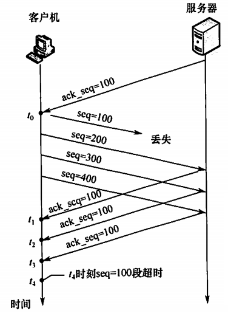

[TOC]

***

## 体系结构

* 计网分类

  * 按范围
    * WAN：广域网，几十千米~几千千米
    * LAN：局域网，几十米~几千米
  * 按交换技术
    * 电路交换网络
    * 报文交换网络
    * 分组交换网络

* 术语

  * 带宽：最高数据传输速率，即比特/s，b/s
  * 时延：
    * 发送时延/传输时延：将所有比特推向链路的时间
    * 传播时延：一个比特从链路的一端传到另一端的时间 = RTT/2
  * 往返时延RTT：从发送端发出一个短分组，到发送端收到来自接收端的确认（接收端收到数据后立即发送确认）的总时延
  * **信道利用率**：有数据通过时间（表示传输时间） ÷（有+无）数据通过时间
    * 另一个公式：alpha = 传播时延τ/传输时延T0
    * 以太网的极限利用率 = T0/(τ+T0) = 1/(1+alpha)
    * alpha越小，即τ越小或者T0越大，意味着利用率越高
    * alpha越大，即τ越大或者T0越小，意味着利用率越低

* **计网结构**

  * OSI的三个主要概念

    * **协议**：控制两个或多个对等实体间通信的规则的集合（**水平的**）
      * 语法+语义+同步
    * **接口**：同一结点内相邻两层间交换信息的连接点
    * **服务**：下层为紧邻的上层提供的功能调用（**垂直的**）

  * 点到点 & 端到端

    

  * OSI模型

    * 自下而上：物理层、数据链路层、网络层、传输层、会话层、表示层、应用层
      * **物理层**：单位：比特；
        * 传输原始的比特信息，规定电路接口的形状、尺寸等
      * **数据链路层**：单位：帧；
        * 点到点，将网络层的ip数据报组成帧；
        * 成帧、差错控制、流量控制、传输管理
        * 协议：SDLC，HDLC，PPP
      * **网络层**：单位：ip数据报；
        * 将高层协议的数据封装成组（分组）
        * **点到点**，利用路由算法，把网络层协议数据单元从源端传到目的端，为不同主机提供通信服务
        * 对分组进行路由选择，流量控制、拥塞控制
        * 协议：IP，ICMP，IGMP，ARP，OSPF
      * **传输层**：单位：报文段(TCP)或用户数据报(UDP)
        * 将上层数据分割为报文
        * **端到端**（进程间通讯），传输层再上面的都是端到端
        * 高层用户可直接通过进程间通信，忽略子网的存在
        * 协议：TCP，UDP
      * 会话层：
        * 用于建立进程间的同步？
      * 表示层
        * 处理两个系统间交换信息的表示方式
        * 进行数据格式转换、加密等操作
      * 应用层
        * 协议：
          * FTP(文件传输)
          * SMTP(电子邮件)
          * HTTP(万维网)

  * TCP/IP模型

    * 从低到高：网络接口层、网际层、传输层、应用层
      * 网络接口层：物理+数据链路
      * 网际层：网络层，将分组发往任何网络，并为之独立选择路由
      * 传输层：传输层，使发送端和目的端的对等实体进行会话
        * TCP：面向连接，单位是报文段，保证**可靠**交付（**按序到达且无差错**）
        * UDP：无连接，单位是用户数据报，不保证可靠交付
      * 应用层：用户-用户
        * 包含的高层协议：FTP，Telnet（虚拟终端），DNS（域名解析），SMTP，HTTP

  * **二者的对比**

    * 相同：
      * 都采取分层
      * 基于独立的协议栈
      * 都可以实现不同计算机间的通信
    * 不同：
      * TCP/IP是以协议为核心，以此为基础来构建模型，OSI不是
      * OSI明确区分了协议、接口、服务这三个概念，TCP/IP没有

  * 整体通信过程：层层包装，传过去后，层层解包

    

* 整体流程：

  

***

## 物理层

* 比特率 与 波特率，两者之间可以根据一个码元携带n比特的信息来进行转换

  * 波特率：码元传输速率（单位时间信号变化的次数/脉冲个数），单位是Baud，**也对应Hz（Hz一定对应的是信号，而不是比特）**
  * 比特率：bit/s

* **奈奎斯特定理 & 香农定理 & 采样频率** 

  * 奈奎斯特定理：**理想**低通信道中（无噪声），若要避免码间串扰，**极限码元传输率**为
    * **2W(Baud/s)** 或 **2Wlog2V(b/s)**
    * 其中W是带宽（Baud/s**或者Hz**），V表示每个码元携带信息的数量，log2V表示一个码元对应的比特个数
  * 香农定理：带宽有限且受干扰的信道的**极限数据传输速率**，为
    * **W*log2(1+S/N)  (b/s)**
    * W为带宽（Baud/s或Hz），S/N是信噪比（信号功率/噪声功率）
    * 信噪比换算成dB：10*log10(S/N)
  * **采样频率**：为保证信号正常，采样频率f至少为**2W**

* 常用的数字编码

  

  * 其中，
    * 曼彻斯特：1是中间高往低，0是中间低往高
    * 差分曼彻斯特：1是开始与上一个的结尾相同，0是相反，仍然中间一跳

* **电路、报文、分组**

  * 电路交换：先建立一条专用的通信路径；建立、传输、释放（无差错纠正）

  * 报文交换：以报文为单位，无连接、动态分配路线

  * 分组交换：报文的基础上，限制每个分组的大小，还可细分为两种

    * **分组的优势**

      * 可以使后一个分组的存储操作与前一个分组的转发操作并行，这种流水线式传输方式减少了报文的平均传输时间
      * 便于缓冲区的存储管理（大小固定）

    * **数据报方式**：

      

    * **虚电路方式**：

      * 虚的原因：电路并非专用，每个链路可能同时有若干虚电路通过

      

    * 二者的比较：

      

* 物理层设备（**目的都是扩大网络范围**）

  * 中继器：将信号整型并放大后再转发出去（就是放大器）
* 集线器：多个端口的中继器（注意近似是每个端口均分进来的端口的信号）

***

## 数据链路层

* 功能：

  * 帧定界、帧同步、透明传输（当数据中恰好出现与帧定界符相同的比特组合，采取措施使得可以正常传输）
  * 链路管理
  * 流量控制（针对发送方）
  * 差错控制

* 组帧

  

* 差错控制
  * 奇偶校验码
    * 奇校验码：1的个数为奇数
    * 偶校验码：1的个数为偶数
  * 循环冗余码
    * 生成多项式n项，在原码后面加上n-1个0，然后异或除一下
  * 海明码
    * 纠错d位：需要2d+1位
    * 检错d位：需要d+1位
    * 

* **流量控制与可靠传输**
  * ARQ（自动重传请求）
    * 停止-等待协议：
      * 单帧滑动窗口
      * 一帧一帧传，每帧需要有确认
    * 后退N帧协议GBN：
      * 发送端多帧滑动窗口，接收端单帧窗口
      * 可以在连续收到多个正确的数据帧后，对最后一个发确认信息
      * 如果有一帧没接收到或者出错，则舍弃后面所有哪怕正确的帧，直到
      * 发送窗口Wt <= (2^n)-1，n为帧编号位数
    * 选择重传协议SR：
      * 发送端接收端都是多帧滑动窗口
      * 当一个接受的帧出错时，仍可以接收其他剩下的帧，可以只要求重传没有的一帧
      * 接收窗口Wr <= 2^(n-1)
      * 且满足发送窗口+接收窗口 <=2^n，接收窗口<=发送窗口

* 介质访问控制：
  * 防止两对结点间的通信相互干扰
  * 随机访问介质控制
    * ALOHA协议：
      * 发送点若一段时间未收到确认，认为发生冲突，等待一段时间后重新发送
      * 改进：时隙ALOHA，将时间分为一段段等长的时隙，只有在时隙开始时可以发送帧
    * CSMA协议：
      * CSMA/CD（针对有线）：
        * 
        * 最小帧长：由于要保证在发送数据的同时可以检测到可能存在的碰撞，需要帧的传输时延>=两倍的总线传播时延，
          * 即：**最小帧长 = 2 * 总线传播时延 * 数据传输速率**
        * 二进制指数退避算法：可以使得重传需要的平均时间随着重传次数的增大而增大，16次不行则抛弃此帧
      * CSMA/CA（针对无线）

* 局域网
  * 以太网
    * MAC帧：每收到一个MAC帧，先检查其中的MAC地址，是发往自己的就接受，不是就丢弃
  * VLAN
    * 将较大的局域网分割成一些较小的VLAN，用于划分广播域
    * 可以隔绝广播域和冲突域
      * 广播域：逻辑上的计算机组，该组内所有成员都会收到同样的广播信息
      * 冲突域：一个站点向另一个站点发送信息，除了目的站点以外有多少站点能收到这个信号，这些站点就构成一个冲突域
      * 
      * 一般来说，一个网段是一个冲突域，一个局域网是一个广播域
      * https://zhuanlan.zhihu.com/p/545596151
* 广域网
  * PPP协议
  * HDLC协议

* 数据链路层设备

  * 交换机：

    * 可以在多个端口间建立多个并发连接（集线器不行，只能一个个来）

    * 可以将网络分成小的冲突域，从而为每个工作站提供更高的带宽

    * 可以进行自学习（下面的图为例）

    * 每个端口拥有的带宽和输入端口的带宽相同，因为每次只选择一个进行传输

      

例题：

***

## 网络层

* 功能：
  * 路由与转发
  * 拥塞控制

* 路由算法
  * 动态：
    * 距离-向量路由算法：RIP算法（以跳数作为度量）
    * 链路状态路由算法：OSPF（最短路径问题）
  * 层次路由
    * 区域Area
    * 每个路由器只知道自身区域内的信息，不知道区域外的

* IPv4

  * 格式

    * 首部长度、总长度、片偏移的基本单位分别为4B，1B，8B

    * DF = 0时，可以进行分片

    * MF = 1：后面还有分片；MF = 0：最后一个分片

    * 协议：上层所用的协议

    * 版本：ip的版本，v4还是v6

    * TTL：每经过一个路由器 -1

      

  * 分片：

    * 链路层数据报能承受的最大数据量称为最大传送单元，因此需要将大的分成小的
    * 

  * **IPv4地址**

    * 注意ABC对应的网络号位数以及主机号位数的不同

    * 

    * 

    * NAT：将专用网络地址转换为公用网络地址

    * 子网划分

      * 不划分前：网络号，主机号
      * 划分后：**网络号（网段号），子网号，主机号 —— 相当于把主机号拆开了**
      * 子网掩码：网络号和子网号的二进制位全为1，主机号全为0
      * 作用：分离了广播域，使得**不同的子网间的主机不能直接通讯，而是要通过路由才能通讯**。原因是：不在一个广播域里不能通过ARP获取目的Ip的MAC帧

    * 无分类编址CIDR，即在最后加上掩码的位数来区分网段与主机号

      * 作用：将小的网络汇聚为超网
      * 多个可以匹配时，遵从最长匹配原则（掩码最长的）

      > **最重要的一点！！！注意后面不加/掩码的就是按照ABC类区分，看第一个字节的大小来决定是哪一类地址，加了就是无分类的CIDR地址！！！**

  * 网络层转发分组过程

    * 整体的理解：

      * **IP被MAC帧封装，MAC用于实际链路上的传输，IP用于解封后找方向**
      * 转发过程中，IP原址和目的地址都不变，但是MAC地址原址和目的地址会不断变化（每个路由上重新组装）

    * 到达路由器后，根据目的网络和下一跳地址来决定要到达的路由器

    * 

    * 注意是通过ARP获得下一跳路由器的MAC地址，放入MAC帧后，传播，而不是直接填入IP地址，即实际在链路上传送时，最终必须用的是MAC地址

    * 核心就是下面这张图

      

    * ARP，地址解析协议：

      

    * DHCP，动态主机配置协议

      * 为主机动态地分配IP地址

    * ICMP

      * 例如ping，Traceroute指令
      * ICMP差错报文
        * 

* 例题：好好理解什么时候可以进行通讯

  

  

  

* 存疑：PPP要不要了解

* 

  注意要是最小单位的整数倍

* IPv6

  * 书写方式：点分十进制

    

  * 注意IPv6中不允许分片

* 自治系统

  

  * RIP：只向相邻路由器，是应用层协议

  * OSPF：向整个域进行泛洪，是网络层协议

  * BGP(边界网关协议)

    

* 组播：D类地址格式，仅应用于UDP（TCP是一对一的可靠连接）

  * IGMP协议

* 网络层设备

  * 冲突域 & 广播域：见上面以及这里

    

  * 路由器：连接多个网络，并完成路由转发

    

***

## 传输层

* 功能

  * 提供用户进程之间的通信
  * 端口：提供进程的id（端口号）
    * 套接字：唯一标识一台主机和其上的一个进程，格式为：< IP：端口号 >
    * 熟知端口号：0-1023
  * 面向连接服务：通信前先建立连接，结束后释放连接，如TCP
    * 开销大，适合于可靠性很重要的场景，如FTP、HTTP、TELNET等
  * 无连接服务：通信时直接将信息发到网络中，让信息在网络中尽力往目的地传送，如UDP
    * 简单，执行速度快，实时性好，可以用于DNS，视频通话等

* **UDP协议**

  * 仅在IP上增加了复用、分用以及差错检测，几乎直接与IP打交道

  * 支持一对一、一对多、多对一和多对多

  * 首部的结构：首部固定长度8B，如下：

    

  * 分用：

    

* **TCP协议**

  * 解决可靠、有序、无丢失和不重复问题

  * 是面向字节流的

  * TCP报文段

    * 结构

      * 首部非固定，最短20B
      * 序号：本报文发送的第一个字节的序号；
      * 确认号：期望收到的下一个报文的第一个字节序号
      * SYN：同步位，表示这是一个连接请求
      * ACK：确认位，为1才有效

      

    * TCP连接管理

      * **三握手**

        * 
        * 其中，SYN需要占用一个序列号，左边初始序号选择为x，右边初始序号选择为y，且SYN报文段都要占用一个序号

      * **四挥手**

        * 

      * 总结如下：

        

    * 可靠传输的实现：

      * 序号：建立在字节流上，且拥有序号的说法
      * 确认：类似于回退n帧那种，是**累计确认机制**
      * 重传：超时/冗余ACK 会导致重传（见下面）

    * TCP流量控制

      * **接收窗口rwnd**：接收方根据自己接受的缓存大小，动态调整发送方的发送窗口大小

        * **接收方的接收缓存 - 发送方发来的总和 = 接收方发回去的接收窗口**

      * **拥塞窗口cwnd**：发送方根据对当前网络拥塞程度的估计而确定的窗口值

      * 举例：

        

    * TCP拥塞控制

      * 与流量控制的区别：流量是点对点/端对端（只对应某个特定的接收端），拥塞控制是全局性的，涉及所有主机、路由

      * 最大报文段MSS：报文段的最大长度

      * **发送窗口的上限 = min(rwnd，cwnd)**，单位是**字节**

      * 拥塞避免算法

        * 横轴一格就是一个RTT
        * 慢开始算法：每有一个报文段被确认，cwnd就加1MSS，所以每个RTT会增加发送窗口个MSS，即宏观看来就是*2，直到达到ssthresh（阙值），改用下面的算法
        * 拥塞避免算法：窗口的所有MSS都被确认后，发送窗口线性增大（+1*MSS）
        * 

      * **注意上图中，第16个轮次的时候，8*2>12，要取12，而不能取16**

      * **注意上图中从24变成1的那一段中没有发送，是从1变成2那里开始计算第一段RTT**

      * **收到确认后，窗口才能够滑动**

      * 快重传：连续收到3个重复的ACK，则**立即重传**该报文段

      * 快回复：连续收到3个冗余ACK时，将ssthresh设置为此时cwnd的一半，且cwnd也直接变成一半，如下图（跳过了cwnd变成1的阶段），**立即重传**

        

    * 例题1：

      

    * 例题2：看看下面当有一个段发送失败时，会接着继续发送完窗口内剩余的段，然后等待，直到超时或者收到冗余ack或重复ack时，重新发送失败的那个数据

      

* 总结：

  * **A是客户机，B是服务器**

  * **为何不采用两次握手？**

    * 防止历史连接造成的混乱以及资源浪费，如下图

    * （其实就是只有A确认A->B的报文被B收到了，但是没有B确认B->A的报文被A收到）：

      

  * **为何不采用三次挥手？**

    * 三挥手的话，如果中间第三次挥手的信号丢失，则左边就会一直处在等待的状态而右边直接结束，导致资源浪费
    * 和上面一样（其实就是只有A确认A->B的报文被B收到了，但是没有B确认B->A的报文被A收到）

  * **为什么最后一次挥手要等待2MSL的时间？**

    * 确保最后一次挥手的报文正确到达B，不然可能会出现A关闭了，但是B还没有关闭的情况

***

## 应用层

* 网络应用模型

  * 客户/服务器模型

  * P2P模型

    

* **域名系统DNS**

  * 运行在UDP之上

  * 基于客户/服务器模型的分布式系统

  * 工作流程：

    

  * 两种域名解析方式工作原理

    

* **文件传输协议FTP**

  * 基于客户/服务器模型
  * 由于要求可靠性，使用TCP连接
  * 
  * 控制连接：
    * **服务器端**的端口号：21（**客户端由客户自己提供**）
    * 用来控制信息（连接请求、传输请求等）
    * 在整个会话期间保持打开
  * 数据连接：
    * **服务器端**的端口号：20（**客户端由客户自己提供**）
    * 传送实际的数据
    * 传送完就关闭

* **电子邮件**

  * 大体流程：

    

  * SMTP & POP3

    * **SMTP**
      * 使用TCP（要求可靠），C/S模式
      * 用于**发送邮件**，发送方就是客户，接收方就是服务器
      * 只能传输一定长度的ASCII码的邮件
      * MIME（可以传输转换不成ASCII的邮件），是基于SMTP的
    * **POP3**
      * 使用TCP（要求可靠），C/S模式
      * 用于**读取邮件**
      * 其他的读取的协议：IMAP，HTTP等

* **万维网（WWW）**

  * 超文本传输协议HTTP

    * 使用TCP

    * 工作流程：

      

      
