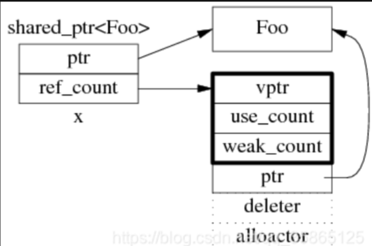
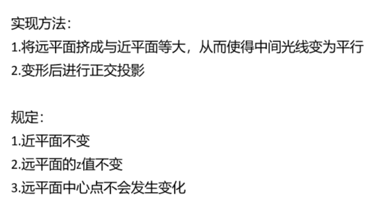

[TOC]


***

## c++：

### 多态：通过虚函数（虚表）实现

* 静态多态（参数不同，编译时确定） & 动态多态（运行时确定）

* 两个解释的非常好的网站：
  * https://blog.twofei.com/496/ 
  * https://www.nowcoder.com/discuss/353148761750839296

1. **虚函数表/虚表：**每个包含虚函数的类都会生成一个虚函数表，其中存储着该类中所有虚函数的地址，如果派生类实现了基类的某个虚函数，则在虚表中覆盖原本基类的那个虚函数指针

   **虚函数指针/虚表指针：**指向该类对象虚函数表的指针（因此构造函数不能是虚函数，因为构造时，虚表指针不存在）

   

2. **虚表不占用类的存储空间，虚指针占用类的存储空间**，因此增加虚函数并不会增加类对象的大小，因为虚指针不变

    

3. 一个类如果有虚函数那么其实例化的对象前8（或4）字节会是**虚表指针**的地址，后面才是成员变量

    

4. 同一个类的不同实例共用**同一份虚函数表（编译时期创建好的）**，注意子类是拷贝的父类的虚函数表不同。**多继承**中，子类修改的是第一个有虚表的父类的拷贝的虚表

   

5. **虚析构函数：**解决基类的指针指向派生类对象，并用基类的指针删除派生类对象，防止造成内存泄漏

    

6. 

7. 类中**虚函数存储的位置：代码段**（与普通的函数相同）。

   * **每个对象都有自己的独立数据成员拷贝，但函数代码是共享的，因此函数代码不会增加每个对象的内存开销。**

   * 代码段：只读，存放函数实现、程序的入口点等

8. 类中**虚表存储的位置：只读数据段（全局区）**

9. 哪些函数不能是虚函数？

   * 构造、内联、静态成员、lambda函数


### 动态内存管理与内存泄漏

* 方法：使用智能指针、内存池等

* **new、delete和malloc、free的区别：**

  (1) malloc/free是**函数**，new/delete是**操作符**

  (2) malloc/free不会调用构造/析构函数，new/delete会**调用构造/析构函数**

  (3) malloc申请的空间不能初始化，new申请的**空间可以初始化**

  (4) malloc返回的**void\*需要强转**，new后跟的是空间类型，不需要

  (5) malloc失败返回NULL,使用时需要判空，new失败**直接抛异常**

  (6) malloc**申请的空间大小需要自己计算**，new申请的空间大小，后面跟上空间类型就行

  (7) new/delete**效率**比malloc/free**稍微低点**，因为new/delete的底层封装了malloc/free


* **placement new：**在指定的位置新创建一个对象（而**不是重新分配内存**）
* **operator new / delete：**全局new，用于分配指定大小的原始内存，可以用于自定义内存分配操作，感觉类似malloc
* 内存池：可以使用这两个操作来进行设计，也可以直接使用std::allocator来进行操作（例如使用mimalloc来操作）


* 
  * 只在堆上：构造函数和析构函数都改为私有，单独提供一个static方法来进行构造


* **智能指针**：

  * 核心思想：将堆内存对象改成栈内存对象，从而有自己的生命周期，可以通过析构函数等操作来释放自己占有的资源

  * 对智能指针的详解：https://juejin.cn/post/7300779577060196362

  * **shared_ptr：**共享，拥有引用计数，最后一个ptr销毁对象

    * 包含两个部分：
      * 引用计数（**refcount**）的指针（线程安全）
      * 引用对象的指针（线程不安全）

    

    * 发生拷贝的过程：

    

    * **线程安全问题：**

      > 同一个shared_ptr被多个线程“读”是安全的。
      >
      > 同一个shared_ptr被多个线程“写”是不安全的。
      >
      > 共享引用计数的不同的shared_ptr被多个线程”写“ 是安全的（因为一次只能有一个指针的引用计数被修改？）

      * shared_ptr中**的引用计数是线程安全**的（即引用次数加减操作会自动上锁）
      * shared_ptr**管理的资源不是线程安全**的（因此要同步，不同步会出现数据竞争）
      * 举例：https://blog.csdn.net/weixin_43850474/article/details/106328641
      * 如何保证多个shared_ptr的读写安全？
        * 使用互斥锁mutex
        * 使用原子操作（更高效？）—— c++20引入std::atomic_shared_ptr
  
    * **weak_ptr：**共享但是不拥有，用于协作shared_ptr工作（避免了两个shared_ptr相互指向对方带来的循环引用问题）
  
    * 注意不要将 裸指针 和 智能指针 混用
  
    * refcount放在动态内存的理由：
  
      * 共享所有权
      * 独立生命周期
      * 更好的管理
  
  * **unique_ptr：**独占，禁止拷贝和赋值，只能移动构造
  
    * 更安全，在出现异常的情况下，利用栈内存的特性，可以确保资源被回收
    
  * **智能指针的构造：**
  
    * **shared_ptr**：可以用new的对象构造，可以用make_shared，可以拷贝，可以解引用
    * **unique_ptr**：可以用new对象构造，可以用make_unique，不可以拷贝、赋值，可以移动，可以解引用
    * **weak_ptr**：只能用shared_ptr构造，不能直接解引用，要先通过Lock()方法获取对应的shared_ptr（是新的，所以**会增加引用计数**），才能解引用


### 单例模式

* 即：**一个类只能创建一个对象，保证类中只有一个实例，该实例被所有程序共享**
* 实现：会提供一个全局访问点
  * 构造函数、拷贝函数、赋值函数都设置为private，防止外界new一个对象
  * 静态成员函数返回唯一实例的指针（静态成员变量）
    * 静态成员变量要在**类外**直接**初始化**完成


### static用法 以及 inline

* **static关键字**
  * **静态全局变量:  **将全局变量隐藏，在外部文件不能访问该全局变量
  * **静态局部变量:**  将局部变量存储在静态存储区,，生命周期扩大为整个程序的生命周期
  * **静态成员变量:**  该成员变量为类中所有对象共有，**类外初始化**，全局唯一， 不需要实例化即可访问
  * **静态成员方法:**  不需要实例化即可访问，只能访问静态成员变量，没有this指针
* **inline关键字**
  * 内联函数，像宏一样直接在调用处进行展开，并且会进行类型转换、安全检查等（**相对于宏**）
  * **如果函数定义和实现都在头文件，如何避免重定义的错误：inline**
  * **和宏的区别**：
    * 宏：预处理阶段替换；inline：编译阶段替换
    * 宏：没有类型检查；inline：有类型检查
    * inline更加安全，遵从作用域和类型规则


### 强制类型转换

* **static_cast**
  * 用于非多态的类型转换
  * 不执行运行时类型检查
  * 常用于转换数值类型（允许转换的情况下）
* **dynamic_cast**
  * 用于多态类型转换，适用于父到子，子到父这类的转换
* **reinterpret_cast**
  * 强制类型转换，直接按位来进行转换
* **const_cast**
  * 去除/添加const属性


### 左值与右值

* 左值：身份引用

* 右值：对“值”的引用

  * **std::move()**：用于将一个对象显式转换成右值引用，从而触发对应的**移动语义（要被定义才能进行资源转移，否则还是拷贝）**
  * 用于：移动操作 和 完美转发
  * **完美转发**：std::forward< T >，会根据T是左值还是右值来进行转发，从而使得将参数从一个函数传递到另一个函数时，参数的类型信息（左右值）保持不变。如下面的例子：

  ```c++
  #include <iostream>
  #include <utility>  // std::forward
  
  void process(int& x) {
      std::cout << "Lvalue reference overload, value: " << x << std::endl;
  }
  void process(int&& x) {
      std::cout << "Rvalue reference overload, value: " << x << std::endl;
  }
  
  template<typename T>
  void forwarder(T&& arg) {
      process(std::forward<T>(arg));
  }
  
  int main() {
      int a = 10;
      forwarder(a);          // Lvalue
      forwarder(20);         // Rvalue
      forwarder(std::move(a)); // Rvalue
      return 0;
  }
  ```

* **emplace_back和push_back的区别：**

  * push_back()传入的一定是一个对象，因此传入的如果不是对象的时候，会先构造一个临时变量，然后将其拷贝到容器中
    * 传入左值时，进行拷贝构造
    * 传入右值时，进行移动构造
  * emplace_back()传入的是构造函数的参数，直接在容器中创建一个新的元素
  * **因此很多情况下，后者会比前者少构造一次对象**

* **左右值引用的区别**

  * 下面的代码中，使用第一个，会输出：,1234（右值引用继承了s中的内容，因此s失效，进行了资源转移）
  * 使用第二个，会输出：1234,1234（const左值引用声明了一个对临时值的左值引用，s不会失效，没有触发移动语义，不转移）


```c++
std::string s = "1234"; // 原始字符串
auto &&s1 = std::move(s); // 将s的资源转移到s1，s1是一个右值引用
// const auto &s1 = std::move(s); // 这里将s移动到一个const左值引用s1

std::cout << s << "," << s1 << std::endl; // 输出s和s1的值
```


### 其他

*  **指针与引用：**

  * **是否初始化**：指针可以不用初始化，引用必须初始化
  * **性质不同**：指针是一个变量，引用是对被引用的对象取一个别名
  * **占用内存单元不同**：指针有自己的空间地址，引用和被引用对象占同一个空间。

*  **内存分区：**

  * **代码区**：存放函数体的二进制代码，由操作系统进行管理；
  * **全局区**：存放**全局**变量和**静态（全局、局部）变量**；
  * **常量区**：存放常量，不允许修改
  * **栈区（stack）**：由编译器自动分配释放, 存放函数的参数值，局部变量等；
  * **堆区（heap）**：由程序员分配和释放，若程序员不释放，程序结束时由操作系统回收。

*  **allocator：**

  * 用于容器中分配内存的操作
    * **allocate**
    * **deallocate**
    * **construct**
    * **destroy**
  * 相较于new/delete的好处？
    * 控制更精细，更容易实现自己的内存池？与容器的契合度高（本身就要传入allocator）

*  **内存对齐的好处：**

  * 提高cpu访问速度，减少访问次数，同时提高了缓存命中率

*  **const和constexpr**

  * const：声明运行时不可改变大小的常量
  * constexpr：声明编译时可以求值的常量，强制编译时求出该值，从而可以减少运行时的开销

*  **浅拷贝和深拷贝**

  

*  **使用vector存储大量数据，游戏中有对象的指针指向这些数据，可能导致的问题：**

  *  扩容、插入、删除操作可能带来**指针失效**的问题（超过空间后，扩容时直接复制，并销毁原来的，导致原来的地址变为空）
  *  性能下降、多次分配内容带来的开销问题
  *  解决：reserve足够大的空间，或者使用**智能指针**来进行存储分配的对象（堆上开辟，位置不变）

*  **vector怎么减容？**

  *  shrink_to_fit()：将capacity缩小至与size相同

  *  交换清空法，利用一个临时复制的新的vec的swap()方法，因为该vec的capacity与size相同

  *  **直接用一个vector来赋值另一个vector时，新生成的vector的size和capacity大小相同**

*  **红黑树：**

  *  AVL在频繁旋转的情况下，性能大打折扣
     *  而红黑树通过牺牲严格的平衡，换来较少的旋转操作，整体性能提升，最坏O(logn)

  *  原则：
     *  结点非黑即红

     *  根黑

     *  叶子黑

     *  红的两个子节点一定是黑

     *  任意节点到其每个叶子的所有路径中，黑节点数量相同

  *  特性（即**为什么map要使用红黑树**）：
     *  **自平衡**（插入删除后会重新着色，且复杂度都为O(n)）

     *  **有序**：属于二叉搜索树

     *  性能优异

     *  最坏情况保证复杂度也为O(logn)
  *  **缺点**
     *  **空间占有率高**，因为每个结点需要额外保存父结点、红黑性质等

*  **指针常量和常量指针**

  *  指针常量：指针本身是常量，声明方法：int* const ptr
  *  常量指针：指向的是常量，声明方法：const int* ptr

*  **顶层const与底层const**

  *  顶层const：对象本身是const
  *  底层const：指针或者引用指向的对象是const

*  **extern "C"**

  *  将该部分代码按照C的方式进行编译
  *  由于**C++支持函数重载**，因此编译器**编译函数的过程中会将函数的参数类型也加到编译后的代码中，而不仅仅是函数名**；而C语言并不支持函数重载，因此编译C语言代码的函数时不会带上函数的参数类型，一般只包括函数名。

*  **随机生成一个圆中的采样点**

  *  直接随机生成极坐标的θ和R即可

*  **链表遍历和数组遍历谁比较快？为什么？从CPU内存访问角度怎么理解？**

  *  数组访问会更快一些。

    原因：数组是具有相同的数据类型且按一定次序排列的一组变量的集合体，构成一个数组的这些变量称为数组元素数组在内存中的地址是连续相邻的，而链表在内存的地址是散列的，不连续的。

    CPU缓存会把一片连续的内存空间读入， 因为数组结构是连续的内存地址， 所以数组全部或者部分元素被连续存在CPU缓存里面，而链表的节点是分散在堆空间里面的，这时候CPU缓存帮不上忙，只能是去读取内存，而缓存的读取速率要比内存快。

*  **对象池的实现思路**

  ```c++
  template<typename Object>
  class ObjectPool{
  public:
  	ObjectPool(size_t unSize) :m_unSize(unSize){
  		for (size_t unIdx = 0; unInx < m_unSize; ++unIdx){
  			m_oPool.push_back(new Object());
  		}
  	}
  	~ObjectPool(){
  		std::list<Object*>::iterator iter = m_oPool.begin();
  		while (iter != m_oPool.end()){
  			delete(*iter);
  			++iter;
  		}
  		m_unSize = 0;
  	}
  	Object* GetObject(){
  		Object* pObj = NULL;
  		if (0 == m_unSize){
  			pObj = new Object();
  		}
  		else{
  			pObj = m_oPool.front();
  			m_oPool.pop_front();
  			--m_unSize;
  		}
  		return pObj;
  	}
  	void returnObject(Object* pObj){
  		m_oPool.push_back(pObj);
  		++m_unSize;
  	}
  private: 
  	unsigned int m_unSize;
  	std:list<Object*>m_oPool;
  };
  ```

  *  最简单的对象池思路很清晰，就是预先分配好，在需要对象的时候取出管理对象的指针，用完后再返还，如以上代码所示。特别强调问题的是对象池回收时重复利用，当**取出来后要注意，是不是要对对象做一次reset之类的操作，防止对象上一次的调用残留数据对本地调用构成影响**，这个要根据自己对象的特点去进行相应的reset操作，比如可以有个基类object，然后利用多态去实现调用子类的不同的reset。


***

## 图形学

### 渲染管线

* 流程：
  * cpu阶段进行**视锥体剔除**（粗略，通过物体边界剔除掉在摄像机视锥体之外的**物体**）、渲染排序，提交draw call之后，
    * 一、顶点处理（**vertex shader**）：进行MVP变换到**投影空间（裁剪空间）**
    * 二、（可选）**tessellation shader & geometry shader**
      * 前者：细化曲面
      * 后者：对顶点进行进一步操作
    * 三、光栅化(**Rasterization**)：
      * **裁剪**（精细，针对**图元**，下面细说）
      * 裁剪坐标除以w变换到**NDC**
      * **背面剔除**
        * openGL中可以通过设置GL_CULL_FACE，还有设置剔除gl_back，默认正面为逆时针gl_ccw
        * 还可以用视线与交点的向量和法向量求点乘？
      * 变换到屏幕坐标（视口变换）
      * 图元装配(primitives)
      * 最终**光栅化**为像素点
    * 四、片元处理（**fragment shader**）：进行着色操作
    * 五、**输出合并：**alpha测试、stencil测试、depth测试、color blending
    * **最终：输入到帧缓冲中**


* 补充：**裁剪**
  * 
  * 执行完成裁剪 + 转换到NDC后，坐标的范围应该为[ -1, -1, -1] 到 [ 1, 1, 1]
  * 其中，z值是在变成屏幕坐标时，映射到了[0, 1]
  
* 补充：**early-z**
  * 传统渲染管线是在着色后进行深度测试，但是这样浪费了被丢弃但是计算了的部分
  * 早期深度测试：在着色前进行深度测试，**先丢弃，后着色，最后再测试一遍**
  * 实现：先只渲染一遍深度，然后用这个深度图来进行着色片段的渲染
  
* 补充：**alpha-test、透明半透明物体渲染**
  * alpha-test是从远到近进行的
  * 先渲染不透明物体，再渲染透明 / 半透明物体
    * alpha-blend：将前景和背景颜色进行混合（根据alpha值）
  
* 补充：**坐标系变化过程相关**

  

  * **view矩阵推导**：

    * 看做相机先在原点旋转，然后移动

    * 因此从世界坐标变为相机坐标：先逆移动，然后逆旋转（其中，旋转倒过来想，世界旋转到相机方向是[u, v, n, 0]，而旋转矩阵的逆就是旋转矩阵的转置，因此转置一下即可）

      

    * 最终结果：

      

  * **Projection矩阵推导（perspective & orthographic）**：

    * perspective推导过程：
    * 

    


### 多重采样

* MSAA：
  * 同一像素点中不同采样点，最终颜色混合
    * 注意buffer是要扩大对应倍数的，depth和color
  * 查找**边缘**：通过**同一像素内的不同采样点的深度和颜色**是否有较大区别来进行判断
  * 进行的阶段：从光栅化开始，一直到最后的输出合并阶段
* SSAA：
  * 超分辨率，分辨率真实变大
* TAA
  * 可能会导致拖影


### 延迟渲染

* 前向渲染：
  * 对象的所有图元都要渲染，无论是否被遮蔽，渲染完成后进行剔除
  * 问题：
    * 可能出现渲染完了，结果又被深度测试丢弃的情况
    * 光源数量多的时候，一共要进行 光源数 * 物体数 次渲染，浪费性能
* **延迟渲染：**
  * 将片段着色延迟到深度测试之后，并且开辟一个屏幕空间的缓冲 g-buffer
  * 大体分为两步：
    * **几何处理阶段Geometry Pass**：对场景进行一个无光源的绘制，写入position，normal，diffuse，specular等光照需要的材质参数项到 g-buffer 中
    * **光照处理阶段Lighting Pass**：用 g-buffer 中的信息，逐像素进行绘制，每个像素逐光源累加着色结果
  * **优点：**
    * 只渲染可见的像素，节省计算量
    * 对后处理支持良好
    * 在大量光源的场景优势明显
  * **缺点：**
    * **内存开销大**
    * 对**透明物体**的渲染存在问题 —— 需要结合正向渲染
    * **对MSAA支持不良好**，因为要开启**MRT（multiple render targets，即一次渲染将中间不同结果写入到不同object上）**，内存**需要多存好多好多东西**，会显著增加内存消耗和带宽需求，且最后计算光照时，对每个像素的多样本进行计算，负担太高？
  * 改进：
    * 延迟光照：Light Pre-Pass
    * 分块延迟渲染：Tile_Based Deferred Rendering


### 实时渲染阴影算法

* **shadow mapping**
  
  * 锯齿：shadow map的分辨率问题
  * 摩尔纹：添加一个Bias来解决（也和分辨率有关，加上倾斜角，导致每次选中的点可能在阴影上，可能在阴影下，导致结果出现摩尔纹）
  * 如何通过shadow map来判断一个点是否在阴影中：
    * 先通过光源的位置来获取变换到光源空间的矩阵，然后对这个点进行这个变换。变换完成后，通过xy获取shadow map上该点的深度值，并与z比较，如果该点的z值显著小于map中的，说明在阴影中
  
* 软阴影做法：

  * PCF**（percentage closer filtering）**：取shading point到光源的距离与shadow map比较时，不止取一个点，取周围范围的点，多次取平均，最后得到可见性

  * PCSS**（percentage closer soft shadow）**：阴影与投射物越近——阴影越硬，实现：

    * blocker search：若在阴影中，与shadow map的深度值相减，获取blocker的平均深度
    * filter：根据平均深度来计算pcf的取的范围
    * 用该范围进行pcf

  * VSSM**（variance soft shadow mapping）**：对pcss的加速，用切比雪夫测试的方法判断当前深度在区域范围内的百分比，直接得到visibility的值，避免了大量的采样

    * 需要额外存储深度平方的shadow map（切比雪夫需要知道方差，which = 平方期望 - 期望平方）

    * 可能存在漏光问题：

      

  * SDF：略


### IBL

* 了解过，暂时没深入，等202完成后再看


### PBR

* kajiya方程：即渲染方程
* PBR相比传统渲染有什么区别：
  * 基于物理，辐射度量学，材质表征更为细腻和真实，传统的模型只是一个特化和近似
* PBR需要贴图中包含哪些内容：
  * 介绍了延迟管线下的MRT需要输出的内容，albedo，法线，粗糙度，金属度，自发光等
* 项目中做的是**离线的微表面模型**
  * 直接用ray来采样下一次发射的ray的方向什么的，最终呈现的结果就已经是diffuse + spec这种了
  * 理论中认为每个微表面都只发生镜面反射
  * 因为使用了重要性采样，所以比较符合物理规律
* **实时的微表面模型Cook-Torrance模型**：
  * 
  * 分为diffuse和specular两项（在离线的基础上添加了diffuse项，用于在粗糙度高的表面进行补偿）
  * 
  * https://www.blurredcode.com/2021/05/dec701b2/


### 加速结构

* bvh：构建耗时大，对动态的支持麻烦，但是对射线的求交效率很高


### 其他

* **blinn-phong 和 phong 的区别：**

  * 区别在于计算高光的部分：
    * **phong**：使用反射方向和视线方向点乘
    * **blinn-phong**：使用**半程向量和法线方向**点乘
  * **后者**计算更简单，因此**更高效**，且**在glaring angle下，blinn-phong表现更好**
    * 因为phong在这个情况下，点乘的值变化非常剧烈

* **blinn-phong的计算**：

  * 

* **法线矩阵：**

  * 在进行缩放操作时，如果直接使用模型矩阵，并且是**非等比缩放**，会导致缩放前后法向量出现问题
  * 用于正确地变换法线，确保其正确性
  * 计算方式：**原来的MVP结果矩阵先求逆，再求转置，最后抹去第4维**
    * 推导：https://blog.csdn.net/wangjianxin97/article/details/109409862

* **重心坐标的计算**，αA + βB + γC：

  * 可以通过顶点对面的三角形面积 / 整个三角形的面积来计算出三个参数的值，
    * 例如 α = PBC / ABC，...
  * 三角形的面积可以用叉乘结果的模 / 2来计算

* **反射方向**的求法：

  * 可以变到局部空间，然后直接很简单的xz取反，y不变

  * 也可以在当前空间下这样做：

    

* **求三维空间中的点P到三角形面片ABC的最近距离**

  * 先求点到三角形平面的距离，计算出平面法向量，然后求出向量PA，PA点乘法向量得到距离

  * 判断投影是否在三角形内部（用叉乘）

  * 在的话，即三个叉乘方向均相同（可通过点乘判断），得到答案

  * 不在的话

    * 若有两个小于0：

      * 通过顶角是锐角还是钝角判断
        * 锐角：则最近点在顶点上（如G）
        * 钝角：再看两条边（如D）

    * 若有一个小于0：则最近点在边上（如E）

      


***

## 项目（掌握好）

### 摄像机部分（找时间细化下）

* yaw：饶y轴转，左右
* pitch：饶x轴转，上下
* 四元数：可以方便的生成旋转矩阵，且变换均匀


***

## 面试部分

### 24-06-18，网易互娱一面：

* 主要问的项目：包含：摄像机设计思路、vector类如何实现 / 是否有意义（**伪需求**）、管线优化具体是什么
* c++八股：多态、泛型编程（虚函数和template的差别在哪里？--template给与不同类型后对应的是不同的类）
* **把摄像机的设计思路好好捋清楚，包括各种细节**
  * xyz轴，position，near_clip，far_clip，fov，aspect_ratio
  * 几个matrix（view，projection）
  * 空间坐标系变换（变为局部、变回世界）
  * 移动函数、视线变化、输入处理（glfw对接）
  * tick函数（每帧更新）
  
* **使用过什么c++的新特性？optional给忘了，别的答答**
  * auto, range for
  * lambda表达式
  * shared_ptr等智能指针
  * std::move和右值引用
  * 在if中添加初始化语句
  * 结构化绑定
  * std::optional

* 印象最深的debug是什么
* 有没有遇到什么性能瓶颈？
* 聊天
  * 可阅读游戏引擎架构这本书
  * 软件工程思维


### 24-06-21，网易互娱二面：

* 准备询问的问题：
  * 引擎和渲染的日常流程区别在哪里
  * 产品主做移动端的话，会和主做pc端的重点有什么不同吗
    * 区别不大，主要在算力、算法
  * 应该学vk好，还是dx或者opengl？
    * 都可以
    * 手机：openGL ES，vk
    * pc：dx
  * 此次面试怎么样
* 主要问的延迟渲染
  * 流程？
  * 主要的优势在哪里？（物体遮蔽关系，其实光源多少不太影响）
  * 什么场景下延迟渲染用的最多？
  * 录音多听听（D盘文档里面）
  * **忘了回答的**：对透明物体的问题


### 06-26，网易互娱hr面

* 自我介绍：西电，软工，研究方向图形学中渲染，三段经历：南大实习+离线光追渲染器+实时渲染器，性格较好，人缘好；
* 想进入网易实习的理由：网易互娱是大公司，在引擎这方面已经有了很多的积累，想趁早进入工业界了解引擎开发的流程、做法、方向，从而好明确自己以后努力的方向，进而踏入游戏行业；杭州、广州位置都挺好，适合；时间自由，暑期进行夏令营，开学后前往网易实习
* 优点：人缘好，擅长团队合作，性格不错
* 缺点：与陌生人交流时会有一些小紧张、有时候做选择会不太果断
* 同事不好沟通：尝试沟通，看看问题出在哪里；听从领导安排，配合同事工作
* 如果录用了，会怎么做：了解工作流程，学习如何熟练使用商业引擎，尽快进入工作流，从小的部分做起，一点点学习进步
* 最后别忘了：
  * 请问哪里可以改进改进
  * 问下结果大概什么时候可以出


***

## 腾讯远程课题：


