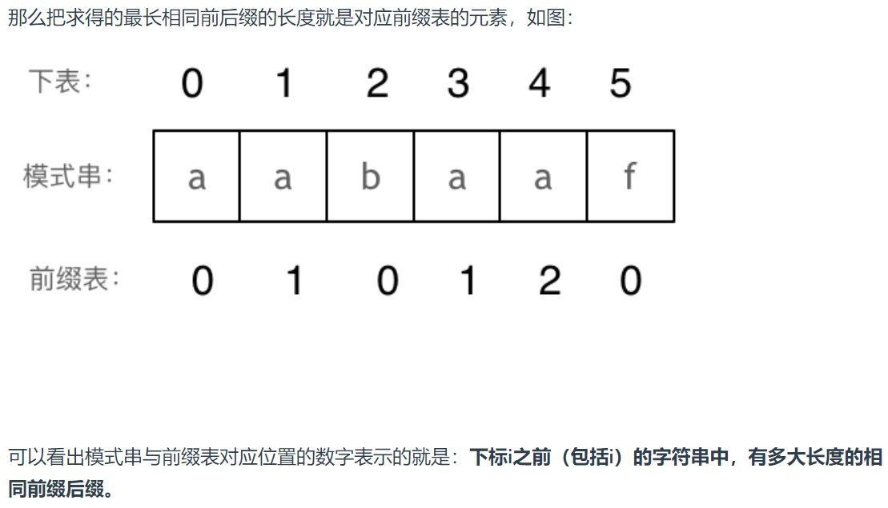
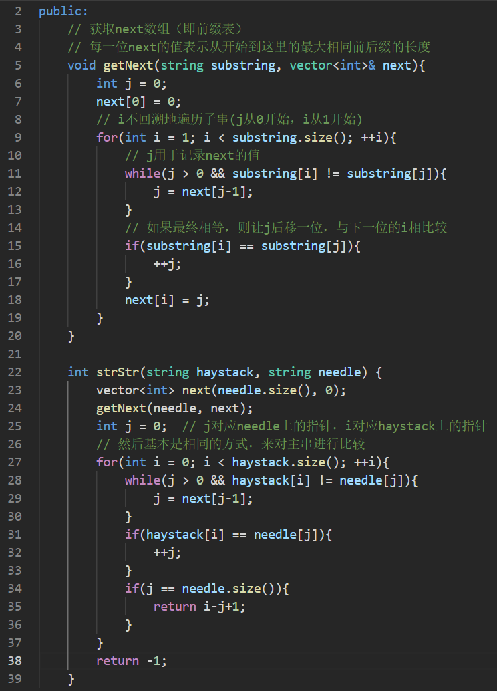
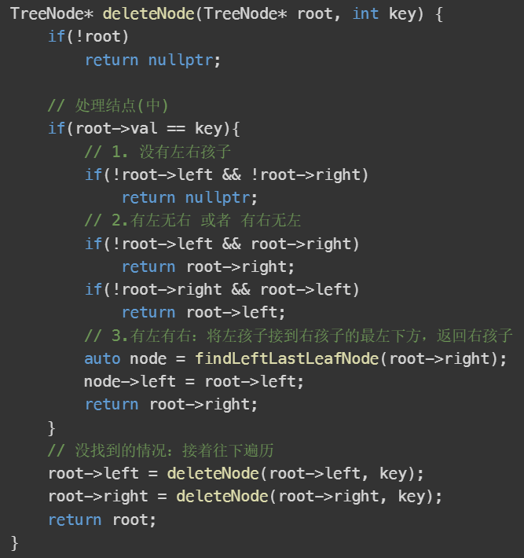
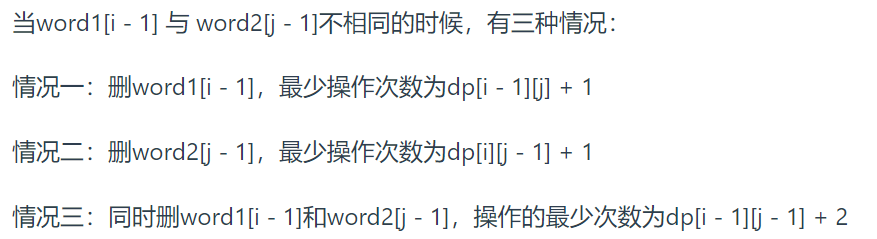

## 技巧

* 想要对map进行排序的话：先转换成pair<T, T>的vector，然后用sort加上自定义函数来对map排序
* 将mid = (left + right)/2 变成 mid = left + (right-left)/2
* 对于字母类的题，可以转换成数组（下标对应为0-25）
* 环形的题目可以拆开考虑，两种情况

***

## 判断

1. int的最大值是2^31 - 1，大约是2*10^9数量级


***

## 数组

* **排序**：快排和归并的板子：见acwing文件夹

* **滑动窗口**：双指针的方法，结合哈希表（用来统计窗口中的信息）
  * 先不停移动右边的指针，直到满足条件
  * 然后移动左边的指针，缩小窗口的范围

* **双指针**：
  * 将O(n^2)优化成O(n)
  * 分为：
    * 同方向双指针：常用于滑动窗口
    * 反方向双指针：当两个数之间有制约关系的时候（一个大了，另一个就要小这种），就可以想到这个
  * 三数之和的思路：排序的重要性，双指针

***

## 链表

* **判断是否成环**：快慢指针，快一次走两步，慢一次走一步，相遇则有环；相遇位置设置新指针，与开头指针同速度一起走，相遇位置就是环的入口处

***

## 哈希表

* unordered_set/map：底层是哈希，查询和增删效率为O1
* set/map等：底层是红黑树，是有序的，查询和增删效率为Ologn
* 创建哈希的技巧：
  * 可以直接将vector的begin和end传进来，然后生成map或者set
* 什么时候用数组作为哈希：
  * 大小范围限制，且数据不太分散的情况
  * 例如给的都是小写字母——暗示可以用数组
* 什么时候用哈希：
  * 当需要统计或者查询的时候
  * 当使用数组作为哈希时，可以直接用vector之间相等来表示统计信息相同（即哈希表相等）

***

## 字符串

* kmp算法

  * next数组：也即前缀表，其中每一位的含义是：从子串开头到这一位的最长相同前后缀的长度

    * 因此，如果当前位匹配不正确，要回到前一位，获取其数值，然后跳转到该数值对应的位置上，如下图：
    * 

  * 求子串位置：大致流程与上面一致

  * 代码如下：

    * 求next数组中的j表示下次与i比较的位置
    * next[i]表示i以及i以前的字符串的最长相等前后缀长度

    

***

## 栈与队列

* **单调栈/单调队列**：保持栈或队列中的元素是按照递增或者递减来排列的（例如，如果当前的元素大于栈或队列中所有元素，则将所有元素出栈并进行相应操作后，将当前元素入栈）

  * 单调栈：用于给出左右两侧下一个更大或者更小数
  * 单调队列（deque实现）：用于得到当前某个连续的范围中的最大值或者最小值（例如滑动窗口最大值那题）

* priority_queue：用于解决前k个最大最小值这样的问题

  * 保证队首一定是优先级最高的元素

  * 求前k个最大值：

    * 用大顶堆：所有的都要插入，然后弹出的前k个
    * **用小顶堆**：每次比较着插入，大于k个就弹出，这样每次弹出的是堆顶的最小值，剩下的k个进行k次弹出并倒叙一下，就是前k个最大值

  * 自定义排序：使用仿函数cmp（定义operator() ），如下

    ```c++
    class Cmp {
    public:
        bool operator()(const Node &a, const Node &b) {
            return a.size == b.size ? a.price > b.price : a.size < b.size;
        }
    };
    int main() {
        priority_queue<Node, vector<Node>, Cmp> priorityQueue;	// 第二个参数是底层实现容器
    }
    ```

  * 注意自定义中，left > right生成的是小顶堆；left < right生成的是大顶堆（与一般的cmp函数反过来）

***

## 二叉树

* 最近公共祖先的思想

* 删除二叉搜索树中的结点：是直接从根开始重新构造一棵树

  

* 在原有的二叉树上修改：可以在原有的基础上重建树，采用递归返回TreeNode结点的形式

* 树上任意一条路径上的两点间的距离：可以使用**前缀和之差**来找到

***

## 回溯

* 横着的一行可以通过排序，来进行剪枝优化
* 去重问题：使用used数组（**注意要先排序保证相同元素相邻！！！**）或者使用unordered_set
  * 这里指的是树层去重
  * 在 candidates[i] == candidates[i - 1] 的情况下：
    * used[i - 1] == true，说明同一树枝candidates[i - 1]使用过
    * used[i - 1] == false，说明同一树层candidates[i - 1]使用过
  * 使用set的情况：
    * 每次for循环外面新建一个uset，用于遍历该层已经使用过的元素
* 组合、分隔、排列问题对应的是树的叶子结点，而子集问题对应的是树的所有节点
* 组合与子集：i每次从st开始，因为前面取过的元素不会再次取
* 排列：树枝去重即可（同一个path已经用过的数不用），i每次从0开始
* 记忆化数组：使用unorder_map或者vector来记录已经递归过的结果，使得下次遇到同样的结果时直接返回答案

***

## 贪心

* 跳跃游戏那里学习最大覆盖范围的想法
* 两个条件都在影响的时候，想办法先定下一个，然后再定下另一个

***

## 动规

* 背包问题：

  * 01背包（每个物品只能用一次）

    * 一维dp的写法dp[j]如下：

      * 注意是先遍历物品，再遍历背包
      * 背包遍历时倒序（不允许物品重复摆放）

      ```c++
      for(int i = 0; i < weight.size(); i++) { // 遍历物品
          for(int j = bagWeight; j >= weight[i]; j--) { // 遍历背包容量
              dp[j] = max(dp[j], dp[j - weight[i]] + value[i]);
          }
      }
      ```

    * 有装满背包有多少种方法、**组合**类的问题的递推公式：

      ```c++
      for(int i = 0; i < nums.size(); ++i){
          for(int j = p_sum; j >= nums[i]; --j){
              //+=：对于每个nums[i]，都可能对dp[j]有贡献，因此相加后就是总的结果数，这就是组合 
              dp[j] += dp[j - nums[i]];
          }
      }
      ```

  * 完全背包（每个物品可以无限使用）

    * 一维dp
      * 背包**顺序**遍历
      * 注意**排列和组合**的区别：
        * 先遍历物品后遍历背包：物品顺序固定，因此一定是组合
        * 先遍历背包后遍历物品：物品出现顺序可以不固定，因此一定是排列
      * 例如：单词组合这种就是排列，因为单词出现有顺序

* 打家劫舍：dp[i]表示的含义是到i时最多的情况，不一定包含i

* 股票问题：

  * dp [i] [0]：到第i天持有股票时的最大金额
  * dp [i] [1]：到第i天不持有股票...
  * 是否有2,3,4...：看有无交易次数限制
  * 注意也是表示到第i天的最大值，不一定在第i天一定发生某个动作
  * 有冷冻期的那题就相当于打家劫舍

* 子序列问题：

  * dp的两种含义：

    * 以nums[i]为**结尾**的...子序列的长度
      * 适用于：连续、前后有比较要求的（即需要知道最后一个的值，与当前的值进行比较的）
    * **[0, i]**中符合条件的子序列的长度（**不一定包含i**）
      * 这种情况下需要考虑 nums1[i] != nums2[j] 时的情况

  * 对于**最长公共子序列**问题：**dp [i] [j]的定义一般会多定义一行一列**，为了方便初始化，例子如下：

    ```c++
    int findLength(vector<int>& nums1, vector<int>& nums2) {
        // 子序列这里一般都是用i-1和j-1的定义，就是为了方便初始化，不用单独考虑别的情况
        // dp[i][j]的含义：以nums1[i-1]结尾，且以nums2[j-1]结尾的共同子串的长度
       	vector<vector<int>> dp (nums1.size() + 1, vector<int>(nums2.size() + 1, 0));
        int result = 0;
        // 注意这里i和j都是从1开始
        for (int i = 1; i <= nums1.size(); i++) {
            for (int j = 1; j <= nums2.size(); j++) {
                if (nums1[i - 1] == nums2[j - 1]) {		//注意是i-1和j-1
                    dp[i][j] = dp[i - 1][j - 1] + 1;
                }
                if (dp[i][j] > result) result = dp[i][j];
            }
        }
        return result;
    }
    ```

  * 注意：多定义出来的一行一列不一定是左边一列和上面一行，而是根据递推公式来确定的

* 编辑距离类问题：

  * 注意在删除那里其实有三种情况

    

    * 只是刚好后两种情况相等

* 回文子串类题目

  * 通用方法：中心点扩散的方法，例如下面

    ```c++
    int countSubstrings(string s) {
        // 回文数问题都可以通过找中心点，向两边扩散的方法？
        int num = 0;
        // 中心点（可能是1个：j=0，可能是2个：j=1）
        for(int i = 0; i < s.length(); ++i){
            for(int j = 0; j <= 1; ++j){
                int l = i;
                int r = i+j;
                while(l>=0 && r < s.size() && s[l] == s[r]){
                    num++;
                    l--;
                    r++;
                }
            }
        }
        return num;
    }
    ```

  * 动规的方法：

    * dp [i] [j] 表示区间[i, j]的子序列是否是回文数，由递推公式可知，遍历顺序不是上到下，左到右了，根据题目来判断，如下

    ```c++
    // dp[i][j]表示[i, j]的子序列是否为回文串
    vector<vector<bool>> dp(s.size(), vector<bool>(s.size(), false));
    int res = 0;
    for(int i = s.size()-1; i >= 0; --i){	//从下到上
        for(int j = i; j <s.size(); ++j){	//从左到右
            if(s[i] == s[j]){
                if(j - i <= 1){
                    res++;
                    dp[i][j] = true;
                }
                else if(dp[i+1][j-1]){
                    res++;
                    dp[i][j] = true;
                }
            }
            else{
                dp[i][j] = false;
            }
        }
    }
    return res;
    ```


***

## 单调栈

* **接雨水**：学习在数组中利用前面已有的数据来进行优化的操作

  ```c++
  // 从左往右遍历，找每个数左边的最大值
  maxLeft[0] = height[0];
  for(int i = 1; i< height.size(); ++i) {
      maxLeft[i] = max(maxLeft[i-1], height[i]);
  }
  ```

* **最大矩形**：

  ```c++
  // 记录每个柱子 左边第一个小于该柱子的下标
  // 因为最后要用right - left -1，因此0左边要设置为-1
  minLeftIndex[0] = -1;
  for (int i = 1; i < size; i++) {
      int t = i - 1;
      // 要用到这里的类似dp的思想，不然还是会超时
      while (t >= 0 && heights[t] >= heights[i]) t = minLeftIndex[t];
      // while (t >= 0 && heights[t] >= heights[i]) t--;
      minLeftIndex[i] = t;
  }
  ```

  

***

## 图论

* 深搜与广搜：visited数组来防止相邻元素重复访问，也可以改成将一个元素变成另一个值

* 广搜的特殊作用：可以找到最短路径，visited的作用：保证不会有路径重复，从而保证是最短

  * 如果要求最短路径长度，可以使用unordered_map来保存<节点，到该节点的路径长度>，例如单词接龙

* **并查集**：用于判断**是否连通**

  * 模板如下：

    ```c++
    int n = 1005; // n根据题目中节点数量而定，一般比节点数量大一点就好
    vector<int> father = vector<int> (n, 0);
    
    // 并查集初始化
    void init() {
        for (int i = 0; i < n; ++i) {
            father[i] = i;
        }
    }
    // 并查集里寻根的过程
    int find(int u) {
        return u == father[u] ? u : father[u] = find(father[u]); // 路径压缩
    }
    
    // 判断 u 和 v是否找到同一个根
    bool isSame(int u, int v) {
        u = find(u);
        v = find(v);
        return u == v;
    }
    
    // 将v->u 这条边加入并查集
    void join(int u, int v) {
        u = find(u); // 寻找u的根
        v = find(v); // 寻找v的根
        if (u == v) return ; // 如果发现根相同，则说明在一个集合，不用两个节点相连直接返回
        father[v] = u;
    }
    ```

    
